# WorkerUnionDAO - Technical Architecture

## System Design Document

**Version**: 1.0
**Last Updated**: 2025
**Status**: Design Phase

---

## Table of Contents

1. [Overview](#overview)
2. [System Architecture](#system-architecture)
3. [Contract Specifications](#contract-specifications)
4. [Data Models](#data-models)
5. [State Machines](#state-machines)
6. [Security Architecture](#security-architecture)
7. [Gas Optimization](#gas-optimization)
8. [Upgrade Strategy](#upgrade-strategy)
9. [Integration Points](#integration-points)

---

## Overview

### Design Principles

1. **Modularity**: Each contract has a single, well-defined responsibility
2. **Security**: Defense-in-depth with multiple layers of protection
3. **Transparency**: All state changes emit events for off-chain indexing
4. **Accessibility**: Simple interfaces that abstract complex logic
5. **Upgradeability**: Designed for future proxy pattern implementation

### Technology Stack

```
┌─────────────────────────────────────────────────────────────┐
│                     Technology Stack                        │
├─────────────────────────────────────────────────────────────┤
│                                                             │
│  Smart Contracts  │  Solidity 0.8+, OpenZeppelin 5.x       │
│  Development      │  Foundry (forge, cast, anvil)          │
│  Testing          │  Foundry Test, >90% coverage target    │
│  Deployment       │  Foundry scripts, Etherscan verification│
│  Frontend         │  Next.js, RainbowKit, Wagmi            │
│  The Graph        │  Subgraph for indexing (future)        │
│                                                             │
└─────────────────────────────────────────────────────────────┘
```

---

## System Architecture

### Component Diagram

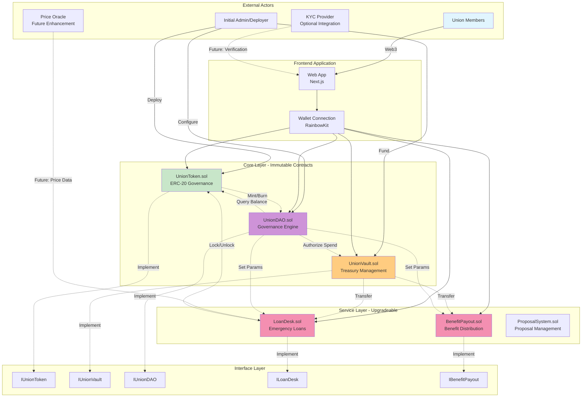

### Contract Dependency Graph

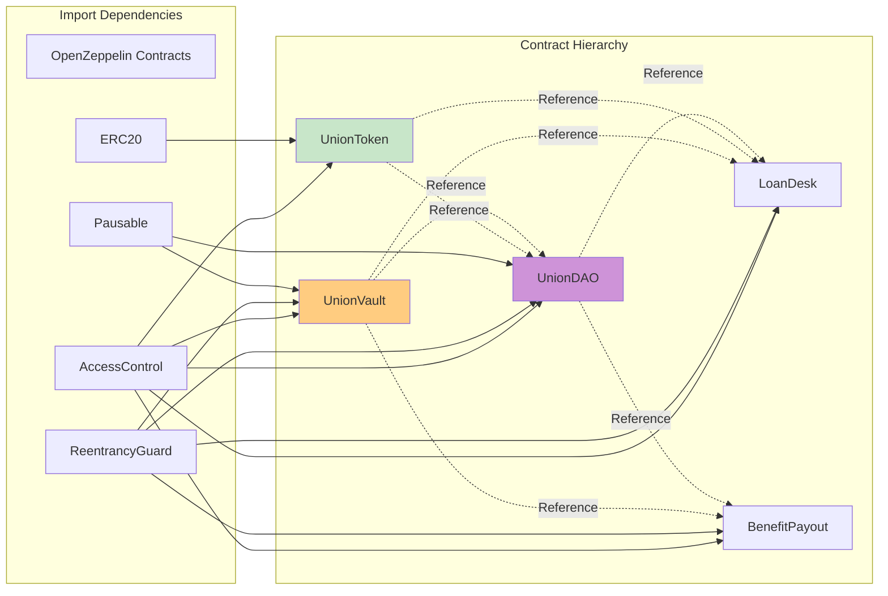

---

## Contract Specifications

### 1. UnionToken.sol

#### Purpose
ERC-20 governance token representing membership and voting power.

#### State Variables

```solidity
// ERC20 Standard
string public constant NAME = "Union Governance Token";
string public constant SYMBOL = "UNT";
uint8 public constant DECIMALS = 18;
uint256 public totalSupply;

// Union-specific
address public unionVault;      // Vault address for token locking
address public unionDAO;        // DAO address for governance
mapping(address => uint256) public lockedTokens;  // Tokens locked as collateral

// Configuration
uint256 public maxSupply;       // Maximum tokens that can be minted
bool public transfersEnabled;   // Enable/disable transfers
```

#### Key Functions

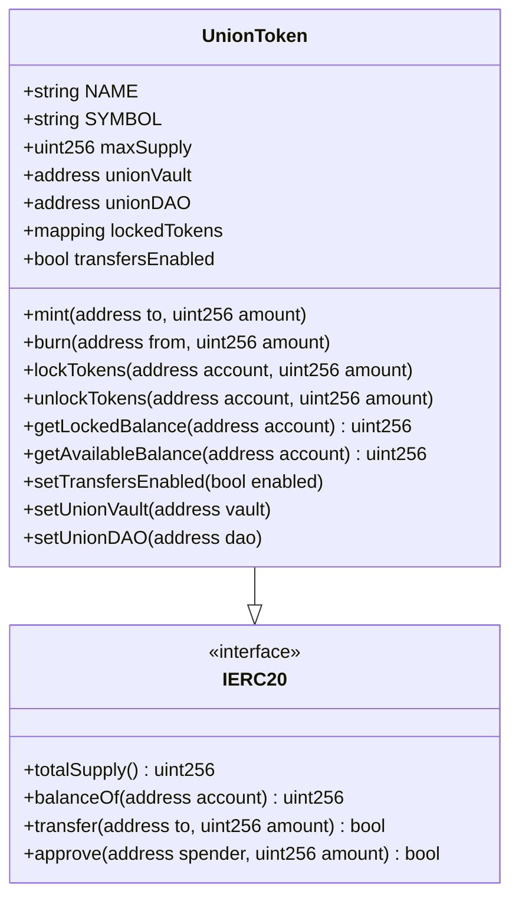

#### Events

```solidity
event TokensMinted(address indexed to, uint256 amount, uint256 timestamp);
event TokensBurned(address indexed from, uint256 amount, uint256 timestamp);
event TokensLocked(address indexed account, uint256 amount, uint256 timestamp);
event TokensUnlocked(address indexed account, uint256 amount, uint256 timestamp);
event TransfersToggled(bool enabled, address indexed by);
```

#### Access Control

| Role | Description |
|------|-------------|
| `DEFAULT_ADMIN_ROLE` | Can grant/revoke roles, update config |
| `MINTER_ROLE` | Can mint new tokens (DAO or admin) |
| `BURNER_ROLE` | Can burn tokens (on exit/vault liquidation) |

---

### 2. UnionVault.sol

#### Purpose
Treasury management for union funds with deposit/withdrawal and share tracking.

#### State Variables

```solidity
// Token Management
IERC20 public stableToken;  // Mock USDC or other stablecoin

// Accounting
uint256 public totalDeposited;      // Total USDC ever deposited
uint256 public totalWithdrawn;      // Total USDC ever withdrawn
uint256 public currentBalance;      // Current balance
mapping(address => uint256) public contributions;  // Member contributions
mapping(address => uint256) public shares;         // Ownership shares

// Configuration
uint256 public withdrawalThreshold;      // Max without DAO approval
uint256 public withdrawalTimelock;       // Seconds to wait for large withdrawals
bool public paused;                      // Emergency pause

// Pending Withdrawals
struct PendingWithdrawal {
    address recipient;
    uint256 amount;
    uint256 timestamp;
    bool executed;
}
mapping(uint256 => PendingWithdrawal) public pendingWithdrawals;
uint256 public nextWithdrawalId;
```

#### Key Functions

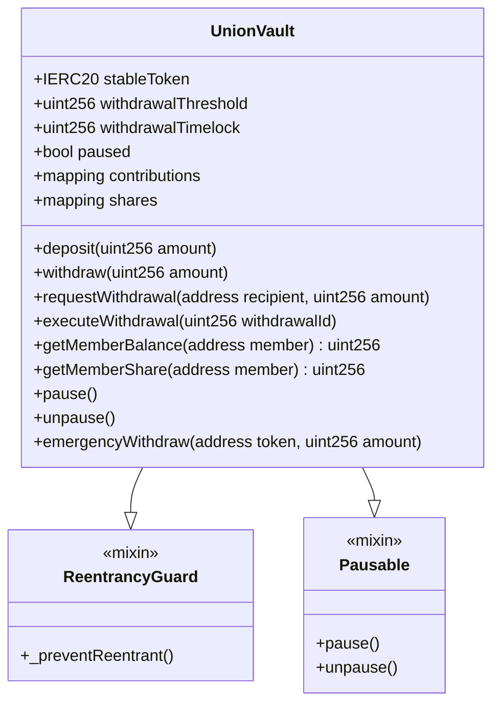

#### Share Calculation

```
Share Calculation:
─────────────────────────────────────────────────────
Member Share = Member Contribution / Total Vault Value

Example:
  Alice contributes: 1000 USDC
  Total vault value: 10,000 USDC
  Alice's share: 10%

When vault earns interest/fees:
  New value: 11,000 USDC
  Alice can withdraw: 1,100 USDC (10% of new value)
```

#### Events

```solidity
event Deposited(address indexed member, uint256 amount, uint256 timestamp);
event Withdrawn(address indexed member, uint256 amount, uint256 timestamp);
event WithdrawalRequested(uint256 indexed id, address recipient, uint256 amount, uint256 executableAt);
event WithdrawalExecuted(uint256 indexed id, address recipient, uint256 amount, uint256 timestamp);
event Paused(address indexed by);
event Unpaused(address indexed by);
```

---

### 3. UnionDAO.sol

#### Purpose
Core governance engine with proposal creation, voting, and execution.

#### State Variables

```solidity
// Token Reference
IUnionToken public governanceToken;

// Proposal Management
struct Proposal {
    uint256 id;
    address proposer;
    string description;
    ProposalType proposalType;
    bytes callData;              // Encoded function call
    address target;              // Contract to call
    uint256 value;               // ETH/value to send
    uint256 forVotes;
    uint256 againstVotes;
    uint256 abstainVotes;
    uint256 startTime;
    uint256 endTime;
    bool executed;
    bool canceled;
    mapping(address => bool) hasVoted;
}

enum ProposalType { SPEND, PARAMETER, MEMBERSHIP, CUSTOM }

mapping(uint256 => Proposal) public proposals;
uint256 public nextProposalId;
Proposal[] public allProposals;

// Voting Configuration
uint256 public votingPeriod;          // Duration in seconds (e.g., 7 days)
uint256 public quorumNumerator;       // % of total supply needed (e.g., 40 = 40%)
uint256 public quorumDenominator = 100;
uint256 public executionTimelock;     // Delay before execution (e.g., 48 hours)

// Counts
uint256 public proposalCount;

// Tracking
mapping(address => uint256) public lastVoteTime;  // For cooldowns (optional)
```

#### Key Functions

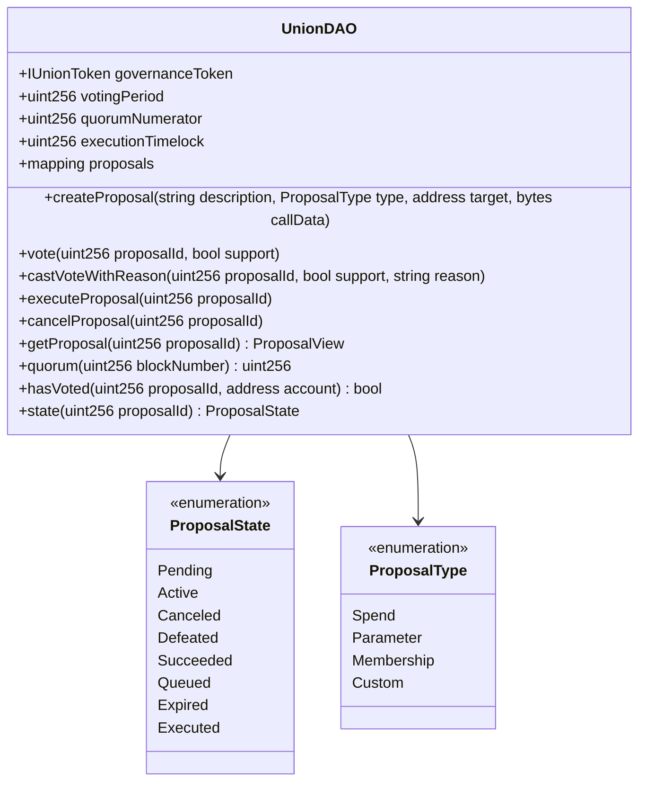

#### Proposal State Machine

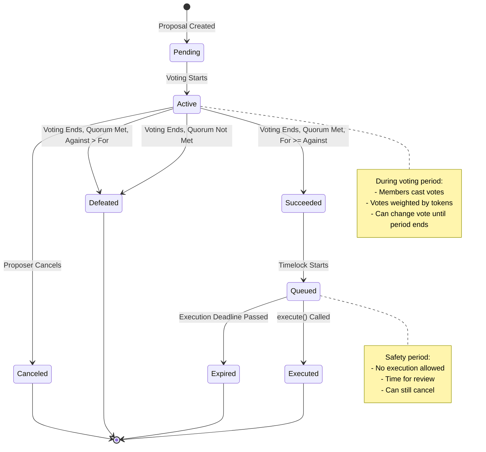

#### Voting Power Calculation

```
Voting Power Calculation:
─────────────────────────────────────────────────────
Voting Power = Token Balance - Locked Tokens

Example:
  Alice holds: 100 UNT
  Alice has locked: 25 UNT (loan collateral)
  Alice's voting power: 75 UNT

Vote Weight = Voting Power at vote time
```

#### Quorum Calculation

```
Quorum = (Total Supply × Quorum Numerator) / Quorum Denominator

Example Configuration:
  Total Supply: 10,000 UNT
  Quorum: 40%
  Required votes: 4,000 UNT

Proposal Passes If:
  1. Total votes >= Quorum (4,000 UNT)
  2. For votes > Against votes
```

#### Events

```solidity
event ProposalCreated(
    uint256 indexed id,
    address indexed proposer,
    string description,
    ProposalType proposalType,
    uint256 startTime,
    uint256 endTime
);

event VoteCast(
    uint256 indexed proposalId,
    address indexed voter,
    bool support,
    uint256 weight,
    string reason
);

event ProposalExecuted(uint256 indexed proposalId, uint256 timestamp);
event ProposalCanceled(uint256 indexed proposalId, address indexed by);
```

---

### 4. LoanDesk.sol

#### Purpose
Emergency loan system with automatic underwriting and collateral management.

#### State Variables

```solidity
// Dependencies
IUnionToken public token;
IUnionVault public vault;
IUnionDAO public dao;

// Loan Configuration
uint256 public interestRate;           // Basis points (100 = 1%)
uint256 public maxLoanToContribution;  // Basis points (5000 = 50%)
uint256 public collateralRequirement;  // Basis points (2500 = 25%)
uint256 public minLoanAmount;
uint256 public maxLoanAmount;
uint256 public loanDuration;           // Seconds

// Loan Tracking
struct Loan {
    uint256 id;
    address borrower;
    uint256 principal;
    uint256 interest;
    uint256 collateralTokens;
    uint256 startTime;
    uint256 dueTime;
    uint256 repaidAmount;
    LoanStatus status;
}

enum LoanStatus { ACTIVE, REPAID, DEFAULTED, CANCELED }

mapping(uint256 => Loan) public loans;
uint256 public nextLoanId;
uint256 public totalLoans;
uint256 public activeLoans;
mapping(address => uint256[]) public borrowerLoanIds;

// Limits
mapping(address => uint256) public borrowerTotalBorrowed;
uint256 public maxBorrowerTotal;      // Per-borrower lifetime cap
uint256 public autoApprovalThreshold; // Auto-approve below this amount
```

#### Key Functions

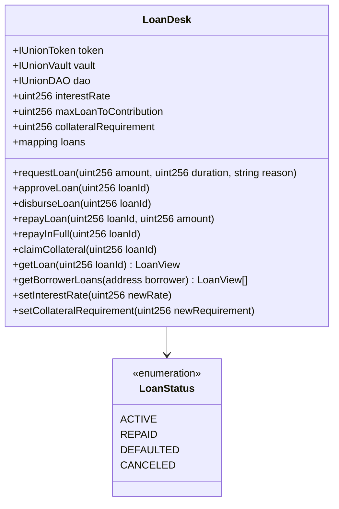

#### Loan State Machine

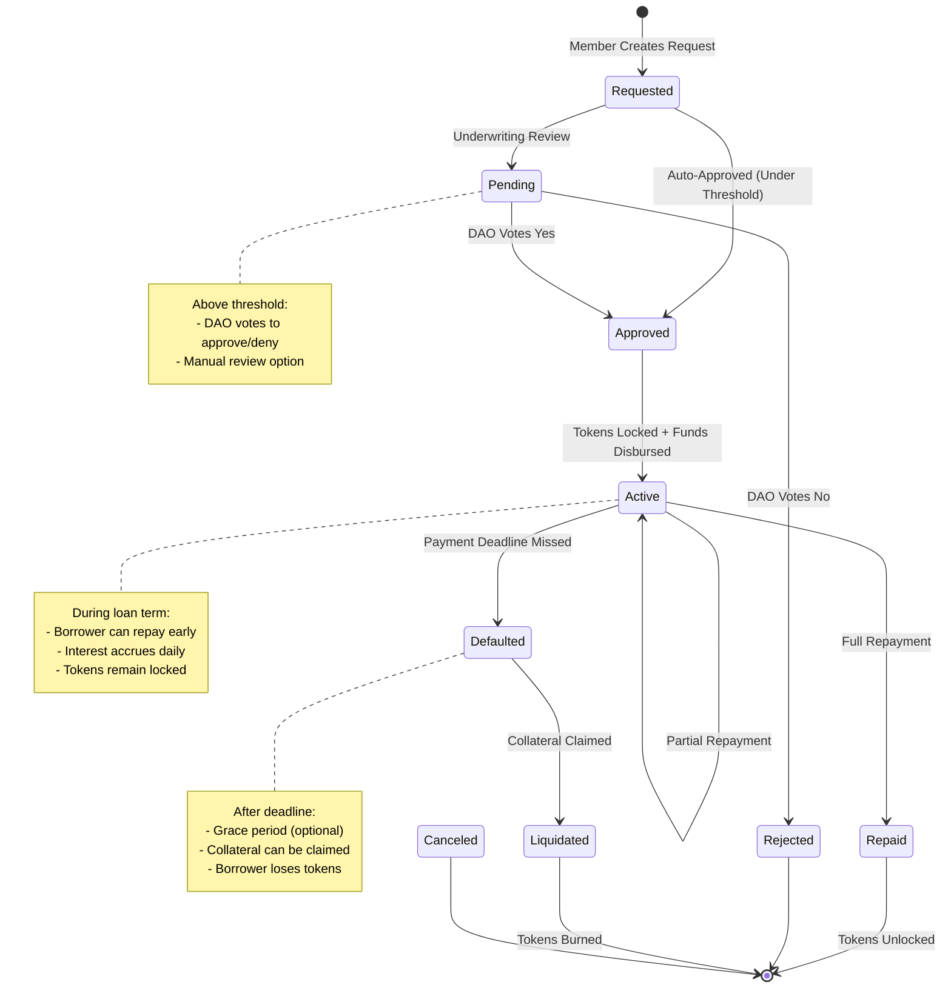

#### Loan Eligibility

```
Eligibility Check:
─────────────────────────────────────────────────────
1. Must have contributed to vault
2. Total borrowed < max borrow cap
3. Request amount <= maxLoanToContribution of contribution
4. Sufficient tokens available for collateral
5. No active defaulted loans

Example:
  Alice's contribution: 1000 USDC
  Max LTV: 50%
  Max loan: 500 USDC
  Collateral required: 25% of loan = 125 UNT tokens
```

#### Interest Calculation

```
Interest = Principal × Rate × (Days / 365)

Example:
  Principal: 500 USDC
  Rate: 5% APY
  Duration: 30 days

  Interest = 500 × 0.05 × (30/365)
  Interest = 500 × 0.05 × 0.0822
  Interest = 2.05 USDC

  Total repayment = 500 + 2.05 = 502.05 USDC
```

#### Events

```solidity
event LoanRequested(
    uint256 indexed id,
    address indexed borrower,
    uint256 amount,
    uint256 duration,
    string reason
);

event LoanApproved(uint256 indexed id, uint256 collateralRequired);
event LoanDisbursed(uint256 indexed id, address indexed borrower, uint256 amount);
event LoanRepaid(uint256 indexed id, address indexed borrower, uint256 amount, uint256 remaining);
event LoanDefaulted(uint256 indexed id, address indexed borrower, uint256 collateralClaimed);
```

---

### 5. BenefitPayout.sol

#### Purpose
Automated benefit distribution with verification and limits.

#### State Variables

```solidity
// Dependencies
IUnionVault public vault;
IUnionDAO public dao;

// Benefit Types
struct BenefitType {
    string name;
    bool enabled;
    uint256 maxAmount;           // Per claim maximum
    uint256 annualLimit;         // Per member annual maximum
    uint256 coolingOffPeriod;    // Seconds between claims
    bool verificationRequired;   // Off-chain verification
}

mapping(bytes32 => BenefitType) public benefitTypes;
bytes32[] public benefitTypeList;

// Member Limits
struct MemberLimits {
    mapping(bytes32 => uint256) claimedThisYear;  // Per benefit type
    mapping(bytes32 => uint256) lastClaimTime;    // For cooling-off
    uint256 lastYearUpdate;
}

mapping(address => MemberLimits) public memberLimits;

// Claims
struct Claim {
    uint256 id;
    address claimant;
    bytes32 benefitType;
    uint256 amount;
    string proofReference;       // IPFS hash or document ID
    uint256 timestamp;
    ClaimStatus status;
    string rejectionReason;
}

enum ClaimStatus { PENDING, APPROVED, REJECTED, PAID }

mapping(uint256 => Claim) public claims;
uint256 public nextClaimId;

// Configuration
uint256 public processingTime;    // Auto-approve after this time (if no rejection)
uint256 public maxTotalPayout;    // Per-claim maximum across all types
```

#### Key Functions

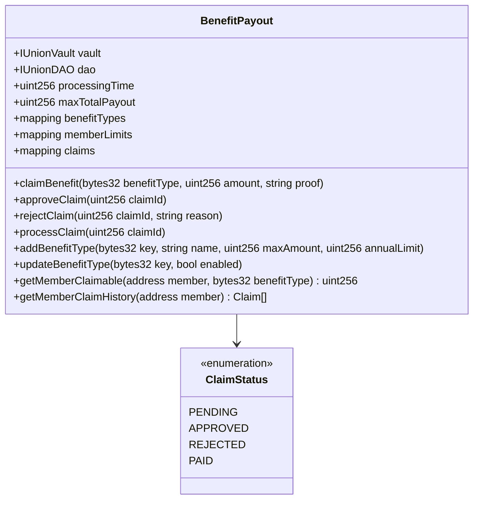

#### Claim Flow

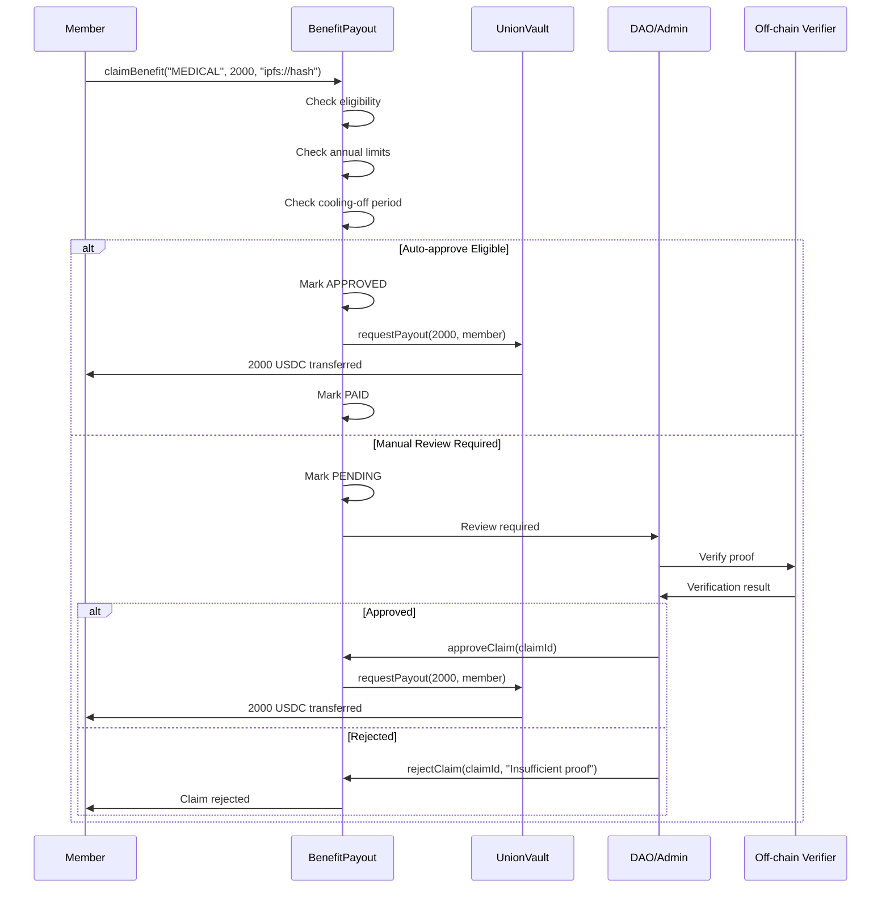

#### Limit Checking

```
Limit Checking Logic:
─────────────────────────────────────────────────────
1. Check benefit type is enabled
2. Check amount <= benefitType.maxAmount
3. Check amount <= maxTotalPayout
4. Check annual claim amount + amount <= benefitType.annualLimit
5. Check current time - lastClaimTime >= coolingOffPeriod

Example:
  Medical benefit config:
    - Max per claim: 3000 USDC
    - Annual limit: 5000 USDC
    - Cooling off: 90 days

  Alice's history:
    - Claimed this year: 2000 USDC
    - Last claim: 60 days ago

  New claim for 2500 USDC:
    - 2500 <= 3000 ✓
    - 2000 + 2500 = 4500 <= 5000 ✓
    - 60 days < 90 days ✗
    Result: REJECTED (cooling-off not met)
```

#### Events

```solidity
event ClaimCreated(
    uint256 indexed id,
    address indexed claimant,
    bytes32 indexed benefitType,
    uint256 amount,
    string proofReference
);

event ClaimApproved(uint256 indexed id, address indexed approver);
event ClaimRejected(uint256 indexed id, string reason);
event ClaimPaid(uint256 indexed id, address indexed claimant, uint256 amount);

event BenefitTypeAdded(
    bytes32 indexed key,
    string name,
    uint256 maxAmount,
    uint256 annualLimit
);

event BenefitTypeUpdated(bytes32 indexed key, bool enabled);
```

---

## Data Models

### Unified State Diagram

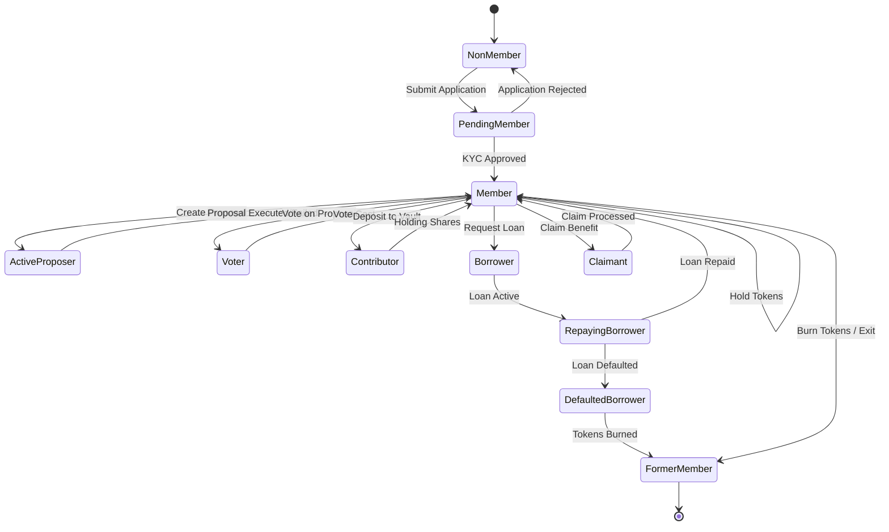

---

## Security Architecture

### Threat Model

```mermaid
graph TB
    subgraph Threats["Potential Attack Vectors"]
        direction TB

        subgraph External["External Threats"]
            E1[Reentrancy Attacks]
            E2[Front-running]
            E3[Flash Loan Attacks]
            E4[Price Manipulation]
        end

        subgraph Internal["Internal Threats"]
            I1[Malicious Proposals]
            I2[Whale Dominance]
            I3[Collusion]
            I4[Key Compromise]
        end

        subgraph Contract["Contract-Level Threats"]
            C1[Integer Overflow]
            C2[Access Control Failure]
            C3[Logic Errors]
            C4[Gas Griefing]
        end
    end

    subgraph Defenses["Defense Layers"]
        D1[Reentrancy Guards]
        D2[Time-locks]
        D3[Quorum Requirements]
        D4[Access Control]
        D5[Slither Analysis]
        D6[Manual Audit]
    end

    E1 --> D1
    E2 --> D2
    E3 --> D2
    E4 --> D2
    I1 --> D3
    I2 --> D3
    I3 --> D3
    I4 --> D4
    C1 --> D5
    C2 --> D5
    C3 --> D6
    C4 --> D5

    style Threats fill:#ffebee
    style Defenses fill:#e8f5e9
```

### Security Checklist

| Category | Item | Status | Implementation |
|----------|------|--------|----------------|
| **Reentrancy** | External call protection | ✅ | `ReentrancyGuard` on all state-changing external calls |
| **Access Control** | Role-based permissions | ✅ | OpenZeppelin `AccessControl` |
| **Integer Safety** | Overflow protection | ✅ | Solidity 0.8+ built-in |
| **Time Manipulation** | Timestamp dependence | ⚠️ | Minimize, use block numbers where possible |
| **Front-running** | Transaction ordering | ✅ | Time-locks on sensitive operations |
| **Gas Griefing** | DoS protection | ✅ | Gas limits, batch operations |
| **Pause Circuit** | Emergency stop | ✅ | `Pausable` pattern |
| **Upgrade Safety** | Proxy considerations | 🔄 | Designed for future UUPS |
| **Audit** | Third-party review | 📋 | Planned for Phase 2 |
| **Testing** | Coverage target | 📋 | >90% planned |

---

## Gas Optimization

### Storage Optimization Patterns

```solidity
// ❌ BAD: Multiple storage reads
function badExample() public {
    uint256 a = data1;
    uint256 b = data2;
    uint256 c = data3;
    // ... use a, b, c
}

// ✅ GOOD: Single storage read via struct
struct Data {
    uint256 data1;
    uint256 data2;
    uint256 data3;
}
Data public data;

function goodExample() public {
    Data memory d = data;
    // ... use d.data1, d.data2, d.data3
}
```

### Packing Booleans

```solidity
// ❌ BAD: Each bool costs 20k gas to deploy
bool public paused;
bool public transfersEnabled;
bool public loansEnabled;

// ✅ GOOD: Pack into single uint8
uint8 public flags; // bit 0: paused, bit 1: transfers, bit 2: loans

function isPaused() public view returns (bool) {
    return (flags & 1) != 0;
}
```

### Event Emission

```solidity
// ✅ Indexed parameters for cheaper filtering
event Transfer(address indexed from, address indexed to, uint256 amount);

// ✅ Batch operations to save events
event BatchTransfer(address indexed from, address[] to, uint256[] amounts);
```

---

## Upgrade Strategy

### UUPS Pattern (Recommended)

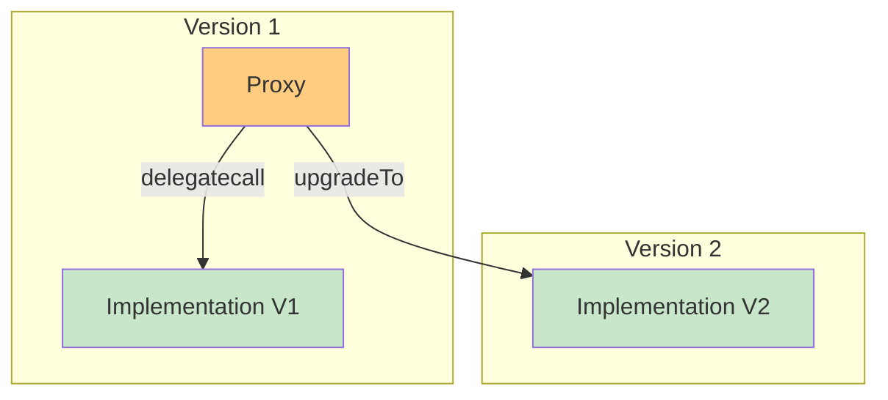

### Upgrade Steps

1. Deploy new implementation
2. DAO votes to approve upgrade
3. Admin calls `upgradeTo(newImplementation)`
4. Proxy delegates to new contract
5. State preserved in proxy storage

---

## Integration Points

### External Integrations

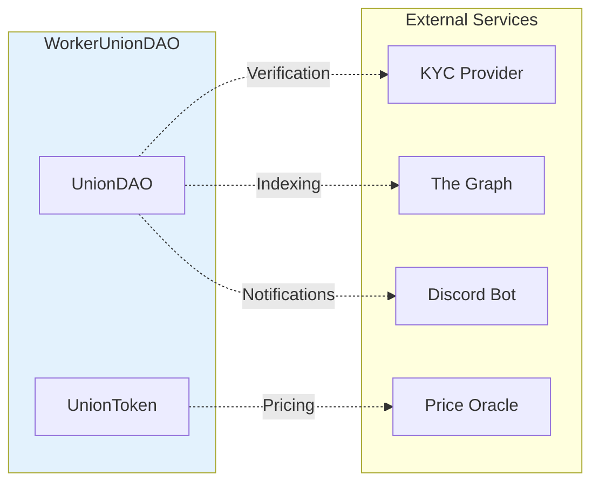

### Future Integration Roadmap

| Phase | Integration | Purpose |
|-------|-------------|---------|
| 1 | None | MVP standalone |
| 2 | The Graph | Index events for frontend |
| 3 | KYC Provider | Real identity verification |
| 4 | Price Oracle | Token valuation for collateral |
| 5 | Discord Bot | Community notifications |
| 6 | Layer 2 | Lower transaction costs |

---

*Architecture Document v1.0 - WorkerUnionDAO*
