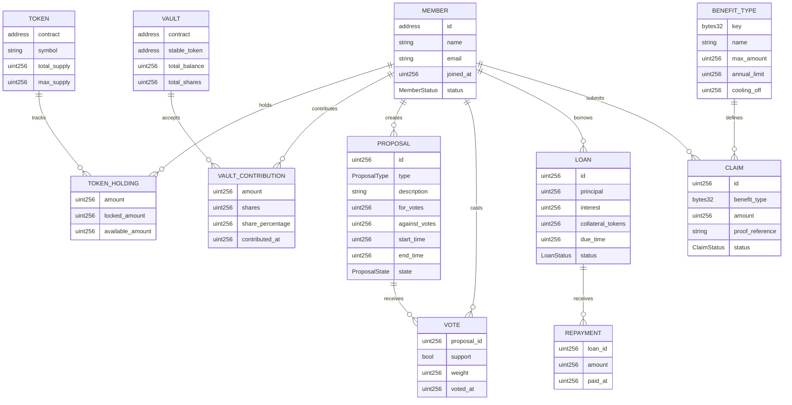

# WorkerUnionDAO - Visual Diagrams

## Complete Visual Documentation

---

## Table of Contents

1. [System Overview](#system-overview)
2. [Contract Architecture](#contract-architecture)
3. [Data Flow Diagrams](#data-flow-diagrams)
4. [State Machines](#state-machines)
5. [Sequence Diagrams](#sequence-diagrams)
6. [Entity Relationships](#entity-relationships)
7. [Network Topology](#network-topology)

---

## System Overview

### Main System Diagram

```mermaid
graph TB
    subgraph "User Layer"
        U1[Workers/Members]
        U2[Administrators]
        U3[External Services]
    end

    subgraph "Application Layer"
        A1[Web Dashboard]
        A2[Mobile App<br/>Future]
        A3[Admin Portal]
    end

    subgraph "Blockchain Layer - Ethereum"
        direction TB

        subgraph "Core Contracts"
            T[UnionToken<br/>🪙 ERC-20]
            V[UnionVault<br/>💰 Treasury]
            D[UnionDAO<br/>🗳️ Governance]
        end

        subgraph "Service Contracts"
            L[LoanDesk<br/>🏦 Loans]
            B[BenefitPayout<br/>🎁 Benefits]
            P[ProposalSystem<br/>📋 Proposals]
        end
    end

    subgraph "Infrastructure"
        I1[The Graph<br/>Indexing]
        I2[IPFS<br/>Storage]
        I3[Etherscan<br/>Explorer]
    end

    U1 -->|Connect| A1
    U2 -->|Manage| A3
    U3 -->|Integrate| A1

    A1 -->|Read/Write| T
    A1 -->|Read/Write| V
    A1 -->|Read/Write| D
    A1 -->|Read/Write| L
    A1 -->|Read/Write| B

    A3 -->|Configure| D
    A3 -->|Override| V

    T -.->|Voting Power| D
    T -.->|Collateral| L
    V -.->|Funds| L
    V -.->|Payouts| B
    D -.->|Control| V
    D -.->|Params| L
    D -.->|Params| B

    D -->|Events| I1
    V -->|Events| I1
    L -->|Events| I1

    A1 -->|Store Docs| I2
    U1 -->|Verify| I3

    style T fill:#c8e6c9
    style V fill:#ffcc80
    style D fill:#ce93d8
    style L fill:#f48fb1
    style B fill:#f48fb1
```



---

## Contract Architecture

### Contract Hierarchy


### Contract Interactions


---

## Data Flow Diagrams

### Member Onboarding Flow


### Proposal Creation & Voting Flow


### Loan Request Flow


### Benefit Claim Flow


---

## State Machines

### Proposal State Machine

```mermaid
stateDiagram-v2
    [*] --> Draft: Member Creates
    Draft --> Pending: Submit to DAO
    Pending --> Active: Voting Starts

    Active --> Active: Votes Cast
    Active --> Canceled: Proposer Cancels
    Active --> Defeated: Voting Ends<br/>For ≤ Against
    Active --> Defeated: Voting Ends<br/>Quorum Not Met
    Active --> Succeeded: Voting Ends<br/>For > Against<br/>Quorum Met

    Succeeded --> Queued: Timelock Starts
    Queued --> Expired: Deadline Passes
    Queued --> Executed: Execute Called
    Queued --> Canceled: Emergency Cancel

    Executed --> [*]
    Canceled --> [*]
    Defeated --> [*]
    Expired --> [*]

    note right of Active
        Voting Period:
        - Members can vote
        - Vote weight = tokens
        - Can change vote
    end note

    note right of Queued
        Timelock Period:
        - Safety delay
        - Can be canceled
        - Review period
    end note
```



### Loan State Machine


### Benefit Claim State Machine


### Member State Machine


---

## Sequence Diagrams

### Complete Member Onboarding


### Proposal Lifecycle


### Loan Lifecycle


### Benefit Claim Processing


---

## Entity Relationships

### Entity Relationship Diagram



---

## Network Topology

### Deployment Architecture


### Transaction Flow


---

## Security Diagrams

### Access Control Hierarchy


### Threat Defense


---

## Gas Flow Diagram

### Gas Costs Overview

```mermaid
pie title "Estimated Gas Costs (Gwei)"
    "Join Union (Mint)" : 150000
    "Deposit to Vault" : 80000
    "Create Proposal" : 120000
    "Cast Vote" : 50000
    "Request Loan" : 100000
    "Repay Loan" : 90000
    "Claim Benefit" : 110000
```

### Gas Optimization Areas

```mermaid
mindmap
    root((Gas Optimization))
        Storage
            Pack structs
            Use uint256 where possible
            Cache storage reads
        Loops
            Batch operations
            Limit iterations
            Use mappings instead
        Events
            Indexed parameters
            Batch emissions
        Calls
            Check-effects-interactions
            Use low-level calls carefully
```

---

*Visual Diagrams v1.0 - WorkerUnionDAO*
