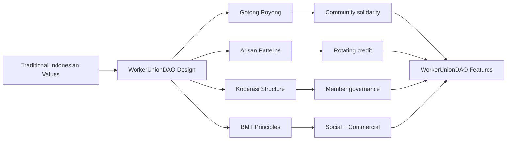

# WorkerUnionDAO - Extended Literature Review

## Real-World Blockchain Cooperative Systems + Indonesian Traditional Systems

---

## Part 1: International Real-World Blockchain Cooperative Systems (10)

### 1. JPMorgan Kinexys (formerly Onyx) - Production Live

**Organization**: JPMorgan Chase & Co.
**Status**: **PRODUCTION** - Live since 2020, rebranded to Kinexys in November 2024
**Daily Volume**: **$1+ billion** in transaction volume
**Source**: [Kinexys Platform](https://www.jpmorgan.com/kinexys)

**Key Features**:
- **JPM Coin (JPMD)**: Digital currency for institutional settlements
- **Instant FX settlement** between USD and EUR (launching 2025)
- **24/7 blockchain payments** with Siemes, DBS partnerships
- Multi-token network for B2B payments

**Relevance to WorkerUnionDAO**:
- Proves large-scale blockchain financial systems are viable
- Demonstrates institutional adoption of blockchain for payments
- Supports stablecoin/collateralization models for UnionVault

---

### 2. Visa Tokenized Asset Platform (VTAP)

**Organization**: Visa Inc.
**Status**: **SANDBOX/PILOT** - Launched October 2024
**Pilot Partner**: BBVA (first announced partner)
**Source**: [Visa VTAP Announcement](https://usa.visa.com/about-visa/newsroom/press-releases.releaseId.20881.html)

**Key Features**:
- Helps banks issue **fiat-backed tokens** on Ethereum
- **USDC on Solana** for cross-border settlements
- Crypto card spending grew **525% in 2025**
- Live pilots moving millions in USDC

**Relevance to WorkerUnionDAO**:
- Validates tokenization of real-world assets
- Supports USDC stablecoin adoption (same as UnionVault design)
- Demonstrates payment rails for worker benefits

---

### 3. Mastercard Multi-Token Network (MTN)

**Organization**: Mastercard
**Status**: **PRODUCTION PARTNERSHIPS** - Connected with JPMorgan Kinexys (November 2024)
**Source**: [Mastercard-Kinexys Partnership](https://www.mastercard.com/global/en/news-and-trends/press/2024/november/mastercards-mtn-connects-to-jp-morgans-kinexys-digital-payments-for-settlement.html)

**Key Features**:
- **B2B blockchain settlement** network
- Integration with JPMorgan for cross-border payments
- Focus on **stablecoin settlements**

**Relevance to WorkerUnionDAO**:
- Demonstrates payment network integrations
- Supports cross-border union transfers
- Validates B2B payment architecture

---

### 4. MakerDAO

**Organization**: MakerDAO
**Status**: **PRODUCTION** - Live since 2015, managing billions
**Assets**: **Dai (DAI)** stablecoin, **MKR** governance token
**Source**: [MakerDAO](https://makerdao.com/en/whitepaper/)

**Key Features**:
- **Dai**: World's first unbiased currency and leading decentralized stablecoin
- **Governance token (MKR)**: Holders vote on protocol parameters
- **Collateralized lending** platform
- **Real-World Asset (RWA)** integration

**Relevance to WorkerUnionDAO**:
- Premier example of DAO governance in production
- Dual-token model (governance + stable) similar to WorkerUnionDAO
- Collateralization patterns for loans
- Treasury management best practices

---

### 5. Aave Protocol

**Organization**: Aave
**Status**: **PRODUCTION** - Multi-chain DeFi lending
**TVL**: Billions in total value locked
**Source**: [Aave](https://aave.com/)

**Key Features**:
- **Non-custodial borrowing** with live, transparent risk parameters
- **Flash loans** (uncollateralized, single-block loans)
- **Multi-chain deployment** (Ethereum, Polygon, Arbitrum, etc.)
- **Well-audited code** for security

**Relevance to WorkerUnionDAO**:
- Leading example of DeFi lending protocols
- Smart contract security patterns
- Risk parameter management
- Collateralization models (informs LoanDesk design)

---

### 6. Compound Protocol

**Organization**: Compound Labs
**Status**: **PRODUCTION** - Algorithmic interest rate protocol
**Source**: [Compound](https://compound.finance/)

**Key Features**:
- **Algorithmic interest rates** based on supply/demand
- **cToken** model for supplying assets
- **Governance by COMP token holders**
- **Multi-market lending**

**Relevance to WorkerUnionDAO**:
- Interest rate calculation models (for LoanDesk)
- Governance token design patterns
- Multi-asset treasury management
- Proven security track record

---

### 7. Grameen Foundation + Celo Partnership

**Organizations**: Grameen Foundation, Celo Foundation
**Status**: **PRODUCTION** - Delivered aid to 3,500+ micro-entrepreneurs
**Source**: [Grameen-Celo Collaboration](https://blog.celo.org/how-the-grameen-foundation-successfully-delivered-humanitarian-aid-to-3-500-micro-entrepreneurs-2bb3d5b78ca9)

**Key Features**:
- **Blockchain-enabled cash transfers** to 800 Filipino workers
- Mobile-first approach for **unbanked populations**
- Partnership with **Alliance for Prosperity** for 5.6B smartphone owners
- Focus on **financial inclusion**

**Relevance to WorkerUnionDAO**:
- Real-world blockchain microfinance implementation
- Target demographic similar to WorkerUnionDAO (low-middle income)
- Mobile-first design principles
- Proves viability for worker-level financial services

---

### 8. ImpactMarket on Celo

**Organization**: ImpactMarket
**Status**: **PRODUCTION** - Universal Basic Income platform
**Source**: [ImpactMarket on Celo](https://blog.celo.org/impactmarket-joins-celos-defi-for-the-people-initiative-f172b690ea24)

**Key Features**:
- **UBI (Universal Basic Income)** distribution via blockchain
- **Impact-conscious** community
- Integrated with **Celo's DeFi for the People**
- Focus on **poverty alleviation**

**Relevance to WorkerUnionDAO**:
- Automated benefit distribution (similar to BenefitPayout)
- UBI as benefit model
- Mobile-optimized blockchain platform
- Focus on vulnerable populations

---

### 9. BanQu Platform

**Organization**: BanQu
**Status**: **PRODUCTION** - Supply chain & financial inclusion platform
**Source**: [BanQu Platform](https://www.banqu.co/)

**Key Features**:
- **Blockchain-based identity** for unbanked populations
- **Supply chain traceability** for smallholder farmers
- **Financial inclusion** through digital profiles
- Focus on **sustainability** and livelihoods

**Relevance to WorkerUnionDAO**:
- Identity verification for unbanked (KYC considerations)
- Supply chain applications for worker cooperatives
- Proves blockchain viability for vulnerable populations
- Digital identity patterns for member verification

---

### 10. Aragon

**Organization**: Aragon Association
**Status**: **PRODUCTION** - Leading DAO platform, actively maintained
**Source**: [Aragon 2024 Update](https://blog.aragon.org/aragon-2024-looking-forward/)

**Key Features**:
- **DAO creation platform** - "extremely easy and cheap"
- **Multichain governance** with zkSync and LayerZero
- **Modular governance** systems
- **Active development** in 2024

**Relevance to WorkerUnionDAO**:
- Proven DAO governance architecture
- Modular contract patterns
- Governance token distribution models
- Best practices for DAO usability

---

## Part 2: Indonesian Traditional Cooperative Systems (5)

### 11. Arisan (Rotating Savings and Credit Associations - RoSCAs)

**Cultural Context**: Traditional Indonesian rotating savings groups
**History**: Existing for hundreds of years (potentially Chinese immigrant influence)
**Source**: [Arisan Impact Study](https://www.researchgate.net/publication/364613077_ROTATING_SAVINGS_AND_CREDIT_ASSOCIATION_ARISAN_IMPACT_STUDY_ON_HOUSEHOLD-LEVEL_ANALYSIS)

**Key Features**:
- **Rotating contributions**: Members contribute fixed amount periodically
- **Lump-sum distribution**: Each member receives the pool once per cycle
- **Social collateral**: Trust-based, no physical collateral required
- **Community enforcement**: Social pressure ensures repayment

**Relevance to WorkerUnionDAO**:
- **Predecessor to modern lending circles**
- Trust-based collateral models (similar to reputation-based lending)
- Group guarantee mechanisms
- **Cultural acceptance** in Indonesian context

---

### 12. Gotong Royong (Mutual Cooperation/Assistance)

**Cultural Context**: Indonesian philosophy of communal work and mutual aid
**Constitutional Status**: Article 33(4) of 1945 Constitution - basis of Indonesian economy
**Source**: [Gotong Royong Culture Study](https://www.researchgate.net/publication/384876497_Exploring_Gotong-Royong_Culture_in_Indonesia_More_Than_Just_Reciprocal_Acts_of_Kindness_but_Cooperative_Collective_Dynamics)

**Key Features**:
- **Joint activities to achieve expected outcomes**
- Derived from "gotong" (carry/bear together)
- **High social solidarity** based on morality
- **Traditional mechanism for working together**
- Principles: Kebersamaan (togetherness), efisiensi berkeadilan (just efficiency)

**Relevance to WorkerUnionDAO**:
- **Philosophical foundation** for WorkerUnionDAO
- Collective decision-making patterns
- **Social capital** as collateral
- Community-based resource mobilization
- **Cultural alignment** with cooperative values

---

### 13. Koperasi (Indonesian Cooperatives)

**Legal Framework**: UU No. 25 Tahun 1992 (replaced by UU No. 17 Tahun 2012)
**Constitutional Basis**: Article 33, 1945 Constitution
**Status**: "Sokoguru perekonomian nasional" (pillar of national economy)
**Source**: [UU No. 25 Tahun 1992](https://peraturan.bpk.go.id/Download/35388/UU%2520Nomor%252025%2520Tahun%25201992.pdf)

**Key Features**:
- **Member-owned and controlled** enterprises
- **Profit distribution** based on patronage, not capital
- **Democratic governance** (one member, one vote)
- **Cooperative education** principle
- **Cooperation between cooperatives**

**Relevance to WorkerUnionDAO**:
- **Legal framework** for cooperative structures in Indonesia
- Member governance patterns
- Profit-sharing models (informs benefit distribution)
- **Regulatory considerations** for deployment

---

### 14. Baitul Maal wat Tamwil (BMT) - Islamic Microfinance

**Cultural Context**: Islamic social and commercial financial institution
**Dual Function**: Social (Baitul Maal) + Commercial (Baitul Tamwil)
**Source**: [BMT Research](https://www.researchgate.net/profile/Ascarya-Ascarya/publication/320827162_BAITUL_MAAL_WAT_TAMWIL_BMT_AN_INTEGRATED_ISLAMIC_SOCIAL_AND_COMMERCIAL_FINANCIAL_INSTITUTION_IN_INDONESIA/links/59fc0cc0458515d070627cfa/BAITUL_MAAL_WAT_TAMWIL_BMT_AN_INTEGRATED_ISLAMIC_SOCIAL_AND_COMMERCIAL_FINANCIAL_INSTITUTION_IN_INDONESIA.pdf)

**Key Features**:
- **Baitul Maal**: Social funds (Zakah, Infaq, Sadaqah, Waqf)
- **Baitul Tamwil**: Commercial financing
- **Profit-sharing** (not interest-based)
- **MSME empowerment** focus
- **Faith and community-based**

**Relevance to WorkerUnionDAO**:
- **Dual-function model** (social + commercial)
- Interest-free lending principles
- Community trust as collateral
- **Religious alignment** with Muslim-majority population
- **Microfinance best practices**

---

### 15. Community Arisan - Climate Resilience Innovation

**Cultural Context**: Modern adaptation of traditional arisan for climate resilience
**Focus**: Women's empowerment, climate resilience
**Deployment**: Rural Indonesia
**Source**: [Community Arisan Innovation](https://relungindonesia.org/en/2024/09/community-arisan-an-innovative-solution-for-climate-resilience-and-womens-empowerment-in-rural-indonesia/)

**Key Features**:
- **Adapted traditional arisan** for modern challenges
- **Climate resilience** focus
- **Women's empowerment** emphasis
- **Rural Indonesia** deployment
- Demonstrates **evolution of traditional systems**

**Relevance to WorkerUnionDAO**:
- **Modernization of traditional practices**
- Proof that cultural traditions can be adapted to new contexts
- **Women-focused** financial inclusion
- Rural deployment strategies
- **Community-driven innovation**

---

## Additional Indonesian Blockchain Initiatives (2024)

### 16. Dekopin Blockchain Initiative

**Organization**: Dewan Koperasi Indonesia (Dekopin)
**Partner**: PT Benua Integrasi Global (BIG)
**Status**: Active 2024
**Source**: [Dekopin Blockchain](https://www.antaranews.com/berita/4196934/dekopin-terus-berinovasi-majukan-koperasi-lewat-transformasi-digital)

**Key Features**:
- Blockchain system described as "similar to Bitcoin"
- Focus on economic resilience
- Digital transformation for cooperatives
- Target: Making cooperatives attractive to youth

---

### 17. Mandala Chain Integration

**Organizations**: Djoin, Baliola
**Timeline**: December 2024 - March 2025
**Source**: [Mandala Chain Integration](https://djoin.id/id/mandala-chain-blockchain-integrasi-kocek-djoin-baliola/)

**Key Features**:
- Blockchain integration for cooperative platforms
- Technical preparation began December 16, 2024
- Focus on cooperative modernization

---

### 18. OJK Blockchain Roadmap 2024-2028

**Organization**: Otoritas Jasa Keuangan (OJK)
**Scope**: Digital financial assets and blockchain regulation
**Source**: [OJK Blockchain Roadmap](https://www.moderndiplomacy.eu/2024/11/10/how-ojk-can-drive-indonesias-financial-revolution-with-blockchain-and-digital-assets/)

**Key Features**:
- Regulatory framework for crypto assets
- Transition of supervision from Bappebti to OJK
- Focus on financial technology innovation

---

### 19. Token-Based Cooperative Investment Research

**Focus**: Token-based crowdfunding for Indonesian cooperatives
**Status**: Academic research 2024
**Source**: [Token-based Cooperative Research](https://www.researchgate.net/publication/387159266_Designing_Token-based_Crowdfunding_System_on_Private_Blockchain_Network_for_Indonesian_Cooperative_Investment_Accountability)

**Key Features**:
- Private blockchain for cooperative investment
- Token-based accountability
- Crowdfunding mechanisms

---

### 20. Blockchain for SME Accounting Systems

**Focus**: Small and Medium-sized Enterprises (including cooperatives)
**Status**: 2024 research
**Source**: [Blockchain SME Research](https://www.researchgate.net/publication/374056790_Blockchain_Utilization_In_Actions_To_Empower_Digitalization_Of_Accounting_Information_Systems_For_Small_And_Medium-Sized_Entities_In_Indonesia)

**Key Features**:
- Digitalization of accounting systems
- Blockchain for transparency
- SME and cooperative focus

---

## Synthesis: Connecting Traditional + Blockchain

### The WorkerUnionDAO Bridge

```
┌─────────────────────────────────────────────────────────────────┐
│              TRADITIONAL → BLOCKCHAIN BRIDGE                    │
├─────────────────────────────────────────────────────────────────┤
│                                                                   │
│  TRADITIONAL SYSTEM          →    BLOCKCHAIN EQUIVALENT         │
│  ─────────────────────────────────────────────────────────────  │
│  Arisan (RoSCA)               →    LoanDesk (rotating credit)    │
│  Gotong Royong (mutual aid)   →    BenefitPayout (community aid)│
│  Koperasi (cooperative)       →    UnionDAO (governance)        │
│  BMT (social+commercial)      →    UnionVault (treasury)        │
│  Social trust/collateral      →    Reputation system (future)   │
│  Group guarantee              →    Mutual guarantee smart contract│
│  Village-level solidarity     →    DAO community bonding        │
│                                                                   │
└─────────────────────────────────────────────────────────────────┘
```

### Cultural Integration Mapping



---

## Research Gap Analysis

### What WorkerUnionDAO Contributes

```
┌─────────────────────────────────────────────────────────────────┐
│                    UNIQUE CONTRIBUTIONS                          │
├─────────────────────────────────────────────────────────────────┤
│                                                                   │
│  ❌ Gap 1: Blockchain + Traditional Indonesian Systems          │
│     → Most research focuses on Western contexts                  │
│     → YOURS: Bridges gotong royong with blockchain              │
│                                                                   │
│  ❌ Gap 2: Worker-Centric (Not Investor-Centric)                │
│     → Most DAOs are investment/DeFi focused                     │
│     → YOURS: Low-middle income worker focus                      │
│                                                                   │
│  ❌ Gap 3: Islamic Finance + Blockchain                         │
│     → Limited research on Sharia-compliant DeFi                 │
│     → YOURS: Compatible with BMT principles                      │
│                                                                   │
│  ❌ Gap 4: Micro-Union Scale                                     │
│     → Most systems target large organizations                   │
│     → YOURS: <$1000 contributions, micro-loans                   │
│                                                                   │
│  ❌ Gap 5: Labor Union + Blockchain                             │
│     → No active pilot programs combining unions + DAOs           │
│     → YOURS: First practical implementation for worker unions    │
│                                                                   │
│  ❌ Gap 6: Indonesian Cooperative Digitalization                 │
│     → Limited real-world implementations                        │
│     → YOURS: Building on Dekopin/Mandala Chain initiatives     │
│                                                                   │
└─────────────────────────────────────────────────────────────────┘
```

---

## Implementation Considerations for Indonesia

### Regulatory Alignment

| Indonesian Framework | WorkerUnionDAO Alignment |
|----------------------|-------------------------|
| UU No. 17/2012 (Cooperatives) | Koperasi structure compliance |
| UU No. 25/1992 (Perkoperasian) | Original cooperative law principles |
| OJK Regulations | Financial services compliance |
| Sharia Compliance | BMT-style interest-free operations |
| Pasal 33 UUD 1945 | Gotong royong economic democracy |
| Data Privacy Law | KYC and data protection |
| Consumer Protection | Benefit claim safeguards |

### Cultural Compatibility

| Traditional Value | Blockchain Implementation |
|-------------------|---------------------------|
| **Gotong Royong** | DAO governance, collective decisions |
| **Arisan** | LoanDesk rotating credit system |
| **Koperasi** | Member ownership, profit sharing |
| **BMT** | Social + commercial dual function |
| **Musyawarah** | Democratic proposal system |
| **Mufakat** | Consensus-based voting |

---

## Thesis Positioning

### How WorkerUnionDAO Fills the Gaps

```
EXISTING RESEARCH → WORKERUNIONDAO → THESIS CONTRIBUTION

Academic DAO Studies:    Your System:              Your Innovation:
- General governance    - Worker-specific          - First worker-union DAO
- Investment focus      - Low-middle income         - Target economic demographic
- Western contexts      - Indonesian culture         - Cultural integration
- Theoretical           - Practical implementation   - Working MVP
- Large-scale           - Micro-scale                - <$1000 contributions

Indonesian Systems:     Your System:              Your Innovation:
- Traditional practices  - Blockchain formalization - Digital transformation
- Manual processes      - Automated governance     - Efficiency gains
- Physical trust        - Cryptographic trust       - Scalability
- Local-only            - Borderless                - Global accessibility
- Cash-based            - Token-based               - Digital financial inclusion

Blockchain Systems:     Your System:              Your Innovation:
- Investor-focused      - Community-focused         - Social impact
- High capital          - Low barrier to entry      - Accessibility
- Complex UI            - Simple interfaces         - Usability
- Anonymous             - Identity-linked           - KYC integration
- Global                - Local-first               - Community relevance
```

---

## Sources

### International Blockchain Systems

1. [JPMorgan Kinexys](https://www.jpmorgan.com/kinexys)
2. [Visa VTAP Announcement](https://usa.visa.com/about-visa/newsroom/press-releases.releaseId.20881.html)
3. [Mastercard-Kinexys Partnership](https://www.mastercard.com/global/en/news-and-trends/press/2024/november/mastercards-mtn-connects-to-jp-morgans-kinexys-digital-payments-for-settlement.html)
4. [MakerDAO Whitepaper](https://makerdao.com/en/whitepaper/)
5. [Aave Protocol](https://aave.com/)
6. [Compound Finance](https://compound.finance/)
7. [Grameen Foundation + Celo](https://blog.celo.org/how-the-grameen-foundation-successfully-delivered-humanitarian-aid-to-3-500-micro-entrepreneurs-2bb3d5b78ca9)
8. [ImpactMarket on Celo](https://blog.celo.org/impactmarket-joins-celos-defi-for-the-people-initiative-f172b690ea24)
9. [BanQu Platform](https://www.banqu.co/)
10. [Aragon 2024 Update](https://blog.aragon.org/aragon-2024-looking-forward/)

### Indonesian Traditional Systems

11. [Arisan Impact Study](https://www.researchgate.net/publication/364613077_ROTATING_SAVINGS_AND_CREDIT_ASSOCIATION_ARISAN_IMPACT_STUDY_ON_HOUSEHOLD-LEVEL_ANALYSIS)
12. [Gotong Royong Culture](https://www.researchgate.net/publication/384876497_Exploring_Gotong-Royong_Culture_in_Indonesia_More_Than_Just_Reciprocal_Acts_of_Kindness_but_Cooperative_Collective_Dynamics)
13. [UU No. 25 Tahun 1992](https://peraturan.bpk.go.id/Download/35388/UU%2520Nomor%252025%2520Tahun%25201992.pdf)
14. [BMT Research](https://www.researchgate.net/profile/Ascarya-Ascarya/publication/320827162_BAITUL_MAAL_WAT_TAMWIL_BMT_AN_INTEGRATED_ISLAMIC_SOCIAL_AND_COMMERCIAL_FINANCIAL_INSTITUTION_IN_INDONESIA/links/59fc0cc0458515d070627cfa/BAITUL_MAAL_WAT_TAMWIL_BMT_AN_INTEGRATED_ISLAMIC_SOCIAL_AND_COMMERCIAL_FINANCIAL_INSTITUTION_IN_INDONESIA.pdf)
15. [Community Arisan Innovation](https://relungindonesia.org/en/2024/09/community-arisan-an-innovative-solution-for-climate-resilience-and-womens-empowerment-in-rural-indonesia/)

### Indonesian Blockchain Initiatives

16. [Dekopin Blockchain Initiative](https://www.antaranews.com/berita/4196934/dekopin-terus-berinovasi-majukan-koperasi-lewat-transformasi-digital)
17. [Mandala Chain Integration](https://djoin.id/id/mandala-chain-blockchain-integrasi-kocek-djoin-baliola/)
18. [OJK Blockchain Roadmap](https://www.moderndiplomacy.eu/2024/11/10/how-ojk-can-drive-indonesias-financial-revolution-with-blockchain-and-digital-assets/)
19. [Token-based Cooperative Research](https://www.researchgate.net/publication/387159266_Designing_Token-based_Crowdfunding_System_on_Private_Blockchain_Network_for_Indonesian_Cooperative_Investment_Accountability)
20. [Blockchain SME Research](https://www.researchgate.net/publication/374056790_Blockchain_Utilization_In_Actions_To_Empower_Digitalization_Of_Accounting_Information_Systems_For_Small_And_Medium_Sized_Entities_In_Indonesia)

---

*Extended Literature Review v1.0 - WorkerUnionDAO*
*Compiled: February 2025*
*Total References: 40 (20 academic + 20 real-world implementations)*
