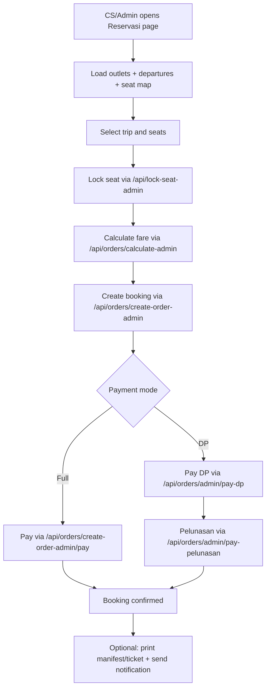
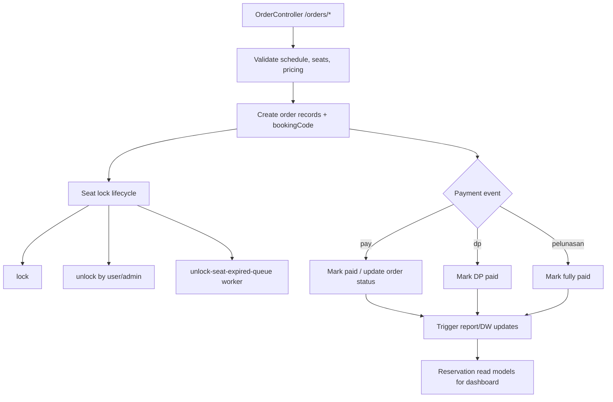
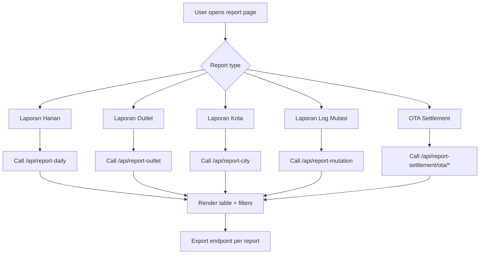
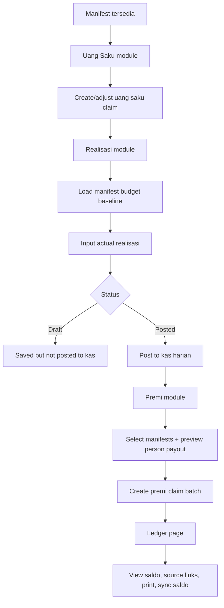
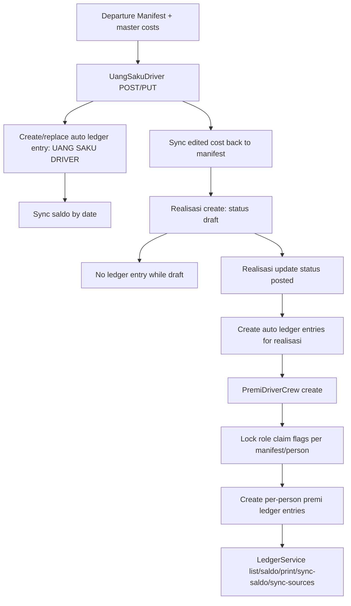

# Putra Remaja App Flows (Dashboard + Backend)

Source mapping was taken from remote server `izcy-engine`, mainly:
- `putraremajadev/pr-shuttle-dashboard`
- `putraremajadev/pr-shuttle-backend`

---

## 1. Booking Flow

### 1.1 Dashboard Flowchart



### 1.2 Backend Flowchart



### 1.3 Use-Case Schema (Dashboard + Backend)

| Actor | Dashboard Use Case | Backend Use Case |
|---|---|---|
| CS/Admin | Search schedule, choose seat, lock/unlock seat | Validate availability, create/cancel/seat mutation |
| CS/Admin | Create booking (`create-order-admin`) | Generate `bookingCode`, persist order set |
| CS/Admin | Pay full / DP / pelunasan | Execute payment handlers and status transitions |
| Supervisor/Admin level | Unlock conflict seat | Enforce lock authorization + queue-based expiry unlock |
| Ops | View reservation list/detail | Aggregate reservation/order views by booking |

---

## 2. Report Flow (DW Function)

### 2.1 Dashboard Flowchart



### 2.2 Backend Flowchart

```mermaid
flowchart TD
  A1[Operational transactions: order/payment/mutation] --> B1[DW updater hooks]
  B1 --> C1[DW collections]
  C1 --> C2[dwreportoutlets]
  C1 --> C3[checkpoint sync state]
  D1[GET /report-outlet/sync-data-warehousing] --> E1[Full/incremental sync process]
  E1 --> C2
  C2 --> F1[/report-outlet query]
  A1 --> G1[/report-daily, /report-mutation, /report-settlement]
  F1 --> H1[Paginated report response]
  G1 --> H1
  H1 --> I1[Export endpoints]
```

### 2.3 Use-Case Schema (Dashboard + Backend)

| Actor | Dashboard Use Case | Backend Use Case |
|---|---|---|
| Ops/Analyst | Open report modules and apply filter | Query report controllers (`report-*`) |
| Ops/Analyst | Trigger export (CSV/XLS/PDF-like) | Build export dataset from report service |
| Admin | Trigger DW sync (`report-outlet`) | Run full/incremental DW sync + checkpoint update |
| System | Auto reflect paid/cancel/mutation events | Update DW aggregates from transactional changes |

---

## 3. Finance Flow (Manifest -> Uang Saku Claim -> Realisasi -> Premi Claim -> Kas Ledger)

### 3.1 Dashboard Flowchart



### 3.2 Backend Flowchart



### 3.3 Use-Case Schema (Dashboard + Backend)

| Actor | Dashboard Use Case | Backend Use Case |
|---|---|---|
| Finance/Ops | Input uang saku per manifest | Validate manifest cost, write `admin/uang-saku-driver`, create ledger auto-entry |
| Finance/Ops | Save realisasi as draft | Persist realisasi with `status=draft` (no kas posting yet) |
| Finance/Ops | Post realisasi | Convert to `posted`, generate ledger entries from realisasi accounting logic |
| Finance/Ops | Build premi claim batch | Validate claim flags, lock claim role, generate premi ledger entries |
| Kas/Admin | Monitor kas harian | Read `admin/ledger`, top-up/pull-saldo/manual/print/sync-saldo |
| Auditor | Trace source transaction | Follow `sourceType/sourceId` links to Uang Saku/Realisasi/Premi documents |

---

## Notes

- Booking APIs are centered at `/orders` and dashboard wrappers call `/api/orders/*`.
- Report DW sync is explicit at `/report-outlet/sync-data-warehousing`.
- Finance posting behavior is explicit in realisasi: `draft` does not create ledger entries, `posted` does.
- Premi batch creation includes claim locking per role and ledger creation.
