# WorkerUnionDAO

## DeFi x DAO Protocol for Worker-Level Unions

**A blockchain-based protocol that empowers workers to collectively organize, pool resources, make democratic decisions, and access financial benefits.**

---

## What is WorkerUnionDAO?

WorkerUnionDAO is a decentralized autonomous organization (DAO) designed specifically for worker unions. It combines DeFi (Decentralized Finance) tools with democratic governance to create a transparent, accessible platform where workers can:

- **Collectively manage** union funds through a shared treasury
- **Vote on decisions** using democratic, token-weighted voting
- **Access emergency loans** without traditional banking barriers
- **Claim benefits** through automated, rule-based distribution
- **Maintain ownership** of their union and its resources

### Why This Matters

Traditional worker unions face challenges:
- ❌ Centralized control by leadership
- ❌ Opaque fund management
- ❌ Slow bureaucratic processes
- ❌ Limited access to financial services
- ❌ Member disengagement

WorkerUnionDAO solves these by:
- ✅ Democratic governance (every member votes)
- ✅ Transparent treasury (all transactions on-chain)
- ✅ Automated processes (smart contracts execute rules)
- ✅ Built-in financial services (loans, benefits)
- ✅ Token-based incentives (members are owners)

---

## How It Works: High-Level Overview

```
┌─────────────────────────────────────────────────────────────────┐
│                        WORKER UNION DAO                         │
├─────────────────────────────────────────────────────────────────┤
│                                                                   │
│  ┌─────────────┐    ┌─────────────┐    ┌─────────────┐         │
│  │   WORKERS   │    │  GOVERNANCE │    │  TREASURY   │         │
│  │  (Members)  │◄──►│  (Voting)   │◄──►│  (Funds)    │         │
│  └─────────────┘    └─────────────┘    └─────────────┘         │
│         │                   │                   │               │
│         ▼                   ▼                   ▼               │
│  ┌─────────────────────────────────────────────────────────┐   │
│  │              SMART CONTRACTS (Ethereum)                  │   │
│  │  • UnionToken    • UnionDAO    • UnionVault             │   │
│  │  • ProposalSys   • LoanDesk    • BenefitPayout          │   │
│  └─────────────────────────────────────────────────────────┘   │
│                                                                   │
└─────────────────────────────────────────────────────────────────┘
```

---

## Core Concepts

### 1. Governance Tokens = Voting Power

Each member receives **UnionTokens (UNT)** when they join:
- **1 Token = 1 Vote** on proposals
- Tokens represent membership and voting power
- Tokens are locked as collateral for loans
- Tokens are burned when members exit

### 2. Shared Treasury

The **UnionVault** holds all union funds:
- Members contribute stablecoins (USDC)
- Funds used for: loans, benefits, community projects
- All transactions visible on blockchain
- Spending requires DAO approval

### 3. Democratic Proposals

Any member can propose:
- 💰 **Spending proposals**: Fund community projects
- 📋 **Policy changes**: Adjust loan rates, benefit limits
- 👥 **Membership**: Add or remove members
- 🏛️ **Governance**: Change voting rules

### 4. Emergency Loans

Members can access loans:
- Up to a percentage of their contribution
- Auto-approved under threshold
- Interest set by DAO vote
- Collateral: partial token lock

### 5. Benefit Distribution

Members can claim benefits:
- Medical emergencies
- Unemployment support
- Education assistance
- Automated verification
- Transparent payouts

---

## User Journey: From Worker to Union Member


---

## The Five Smart Contracts

### 1. UnionToken (Membership & Voting Power)


**What it does:**
- Issues governance tokens to verified members
- Tracks voting power
- Enables token locking for loan collateral
- Burns tokens when members leave

---

### 2. UnionVault (Transparent Treasury)


**What it does:**
- Holds all union funds in stablecoins
- Tracks member contributions and shares
- Executes authorized withdrawals
- Manages loan disbursements and repayments
- Processes benefit payouts

**Key features:**
- All transactions on-chain (transparent)
- Only DAO can authorize large withdrawals
- Emergency pause functionality
- Pro-rata share tracking

---

### 3. UnionDAO (Democratic Governance)

```mermaid
sequenceDiagram
    participant M as Member
    participant DAO as UnionDAO
    participant T as All Members
    participant V as UnionVault

    M->>DAO: Create Proposal
    DAO->>T: 📢 Proposal Announced
    Note over T: Voting Period (7 days)

    loop Each Member
        T->>DAO: Cast Vote (Yes/No)
        Note over T,DAO: Weight = Tokens Held
    end

    Note over DAO: Check Quorum & Majority

    alt Passed
        DAO->>V: Execute Proposal
        V->>V: Transfer Funds
        DAO->>T: ✅ Proposal Executed
    else Failed
        DAO->>T: ❌ Proposal Rejected
    end
```



**What it does:**
- Manages proposal creation and voting
- Enforces quorum requirements
- Time-locks execution for safety
- Executes approved proposals

**Proposal types:**
| Type | Description | Example |
|------|-------------|---------|
| Spend | Transfer treasury funds | Fund community kitchen |
| Parameter | Change system settings | Adjust loan interest rate |
| Membership | Add/remove members | Approve new member |
| Custom | Any other decision | Endorse political candidate |

---

### 4. LoanDesk (Emergency Loans)


**What it does:**
- Enables members to request emergency loans
- Auto-approves under threshold
- Manages collateral locking
- Tracks repayments
- Handles defaults

**Loan terms:**
- Maximum: % of member's contribution
- Interest rate: Set by DAO
- Collateral: Partial token lock
- Duration: Configurable

---

### 5. BenefitPayout (Automated Benefits)


**What it does:**
- Processes benefit claims
- Validates eligibility
- Enforces limits and cooling-off periods
- Executes automatic payouts

**Benefit types:**
- 🏥 Medical emergencies
- 💼 Unemployment support
- 📚 Education assistance
- 🏠 Housing assistance
- 👶 Family support

---

## Complete System Architecture

```mermaid
graph TB
    subgraph "Frontend Layer"
        WEB[Web Application]
    end

    subgraph "Blockchain Layer - Ethereum"
        direction TB

        subgraph "Core Contracts"
            TOKEN[UnionToken<br/>🪙 Governance]
            VAULT[UnionVault<br/>💰 Treasury]
            DAO[UnionDAO<br/>🗳️ Governance]
        end

        subgraph "Service Contracts"
            LOAN[LoanDesk<br/>🏦 Emergency Loans]
            BENEFIT[BenefitPayout<br/>🎁 Benefits]
        end
    end

    subgraph "External Systems"
        KYC[KYC Provider<br/>Optional]
        PRICE[Price Oracle<br/>Future]
    end

    WEB -->|Connect Wallet| TOKEN
    WEB -->|Read Balance| VAULT
    WEB -->|Create/Vote| DAO
    WEB -->|Request| LOAN
    WEB -->|Claim| BENEFIT

    TOKEN -.->|Voting Power| DAO
    TOKEN -.->|Collateral| LOAN

    DAO -.->|Authorize Spend| VAULT
    DAO -.->|Set Interest| LOAN
    DAO -.->|Set Limits| BENEFIT

    VAULT -.->|Funds| LOAN
    VAULT -.->|Payouts| BENEFIT

    KYC -->|Verify Members| WEB
    PRICE -->|Token Value| DAO

    style WEB fill:#e3f2fd
    style TOKEN fill:#c8e6c9
    style VAULT fill:#ffcc80
    style DAO fill:#ce93d8
    style LOAN fill:#f48fb1
    style BENEFIT fill:#f48fb1
```



---

## Key Scenarios

### Scenario 1: Alice Joins the Union

```mermaid
sequenceDiagram
    participant A as Alice
    participant W as Web App
    participant K as KYC (Mock)
    participant T as UnionToken
    participant V as UnionVault

    A->>W: Clicks "Join Union"
    W->>A: Shows registration form
    A->>W: Submits personal info
    W->>K: Request verification
    K->>W: Verification approved
    W->>T: mint(alice.address, 100 UNT)
    T->>A: Receives 100 tokens
    A->>V: deposit(500 USDC)
    V->>A: Receives shares
    W->>A: 🎉 Welcome to the union!
```



---

### Scenario 2: Creating and Funding a Community Project

```mermaid
sequenceDiagram
    participant A as Alice
    participant D as UnionDAO
    participant All as All Members
    participant V as UnionVault
    participant C as Community Center

    A->>D: createProposal("Fund community kitchen", 5000 USDC)
    D->>All: 📢 New Proposal #42

    Note over All: 7-day voting period

    par Member Votes
        All->>D: bob votes YES (50 tokens)
        All->>D: carol votes YES (30 tokens)
        All->>D: dave votes NO (20 tokens)
    end

    Note over D: Tally: YES=80, NO=20<br/>Quorum met!

    A->>D: executeProposal(#42)
    D->>V: releaseFunds(5000, communityCenter.address)
    V->>C: 💵 5000 USDC transferred

    D->>All: ✅ Proposal executed!
```



---

### Scenario 3: Bob's Emergency Loan


---

### Scenario 4: Carol Claims Medical Benefit

```mermaid
sequenceDiagram
    participant C as Carol
    participant B as BenefitPayout
    participant V as UnionVault
    participant D as UnionDAO

    Note over C: Medical emergency: $2000

    C->>B: claimBenefit("Medical", 2000, "hospital_receipt.pdf")
    B->>B: Verify claim & check limits
    B->>D: getBenefitLimit("Medical")
    D->>B: Returns 3000 USDC max
    B->>B: 2000 < 3000 ✓
    B->>V: requestPayout(2000, carol.address)
    V->>C: 💵 2000 USDC transferred

    B->>C: ✅ Benefit paid! Remaining: 1000
```



---

## Token Economics

### Dual Token System

| Token | Purpose | Value Flow |
|-------|---------|------------|
| **UNT (UnionToken)** | Governance, voting, membership | Not currency; represents ownership |
| **USDC (Mock)** | Treasury funds, loans, benefits | Stable value; represents real money |

### Token Distribution (Initial)


### Token Utility

```
UnionToken (UNT) holders can:
├── Vote on proposals (1 token = 1 vote)
├── Create proposals (minimum threshold)
├── Lock as collateral for loans
└── Burn to exit the union
```

---

## Security Features

### What Protects the Union?

```mermaid
graph TB
    subgraph Security["🔒 Security Measures"]
        direction TB

        subgraph Access["Access Control"]
            A1[Role-Based Permissions]
            A2[Multi-Sig for Large Withdrawals]
            A3[DAO Approval for Spending]
        end

        subgraph Smart["Smart Contract Safety"]
            S1[Reentrancy Guards]
            S2[Integer Overflow Protection]
            S3[Emergency Pause Switch]
        end

        subgraph Process["Process Safeguards"]
            P1[Time-Locked Execution]
            P2[Quorum Requirements]
            P3[Cooling-Off Periods]
        end

        subgraph Audit["Audit & Testing"]
            AU1[>90% Test Coverage]
            AU2[Static Analysis (Slither)]
            AU3[Third-Party Audit]
        end
    end

    style Security fill:#ffebee
    style Access fill:#c8e6c9
    style Smart fill:#c8e6c9
    style Process fill:#c8e6c9
    style Audit fill:#c8e6c9
```

### Key Security Mechanisms

1. **Reentrancy Protection**: Prevents malicious actors from draining funds during contract interactions
2. **Access Control**: Only authorized addresses can call sensitive functions
3. **Time-Locks**: Delayed execution prevents rushed decisions
4. **Quorum**: Minimum participation required for decisions to be valid
5. **Pause Circuit**: Emergency stop for critical situations
6. **Pull over Push**: Safer fund distribution pattern

---

## Governance Flow


---

## Comparison: Traditional Union vs WorkerUnionDAO

| Feature | Traditional Union | WorkerUnionDAO |
|---------|------------------|----------------|
| **Governance** | Annual elections, proxy voting | Continuous, token-weighted voting |
| **Transparency** | Annual reports | Every transaction on-chain |
| **Fund Management** | Centralized leadership | Smart contract rules |
| **Member Engagement** | Low (passive members) | High (active participation) |
| **Access to Funds** | Bureaucratic process | Automated loans/benefits |
| **Decision Speed** | Weeks/months | Days (defined periods) |
| **International** | Fragmented | Borderless (same protocol) |
| **Corruption Risk** | Medium-High | Low (code enforces rules) |

---

## Technology Stack

### Smart Contracts
- **Language**: Solidity 0.8+
- **Framework**: Foundry (testing, deployment)
- **Libraries**: OpenZeppelin (security standards)
- **Network**: Ethereum (Sepolia testnet for MVP)

### Frontend
- **Framework**: Next.js (React)
- **Web3**: RainbowKit / Web3Modal
- **Styling**: Tailwind CSS

### Development
- **Testing**: Foundry Test Framework
- **Coverage**: >90% target
- **Security**: Slither, static analysis

---

## Roadmap

### Phase 1: Foundation (Current)
- [x] Architecture design
- [ ] Smart contract implementation
- [ ] Unit testing
- [ ] Security review

### Phase 2: Frontend
- [ ] Web application
- [ ] Wallet integration
- [ ] User interfaces

### Phase 3: Deployment
- [ ] Testnet deployment
- [ ] Mock data seeding
- [ ] End-to-end testing

### Phase 4: Launch
- [ ] Mainnet deployment
- [ ] Documentation
- [ ] Onboarding first union

---

## FAQ

### Is this real money?
For the MVP, we use **mock USDC** (test tokens) on a testnet. Real deployment would use actual stablecoins.

### Do I need to know crypto?
No! The frontend abstracts away complexity. Members just connect a wallet and use simple buttons.

### What if a member loses their tokens?
Lost tokens = lost voting power. This is why we recommend proper wallet backup education.

### Can the DAO be hacked?
We use industry-standard security practices: audited code, access controls, and emergency pauses. No system is 100% secure, but we minimize risks.

### What's the cost?
Gas fees on Ethereum can be high. We're exploring Layer 2 solutions for lower costs.

### Who controls the protocol?
The token holders control the protocol through on-chain governance.

---

## Contact & Resources

- **Documentation**: `docs/` folder
- **Smart Contracts**: `contracts/` folder
- **Tests**: `test/` folder
- **Issues**: GitHub Issues

---

*WorkerUnionDAO: Empowering workers through decentralized governance and accessible finance*
