# WorkerUnionDAO - User Guide

## For Members, Administrators, and Developers

---

## Table of Contents

1. [Quick Start](#quick-start)
2. [Member Guide](#member-guide)
3. [Administrator Guide](#administrator-guide)
4. [Developer Guide](#developer-guide)
5. [Common Workflows](#common-workflows)
6. [Troubleshooting](#troubleshooting)

---

## Quick Start

### Prerequisites

- **Members**: Web3 wallet (MetaMask, Rainbow, etc.)
- **Administrators**: Admin privileges or DAO approval
- **Developers**: Node.js, Foundry, basic Solidity knowledge

### Getting Started in 3 Steps

#### Step 1: Connect Your Wallet

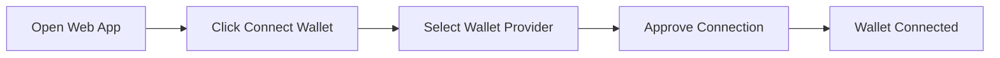

#### Step 2: Join the Union

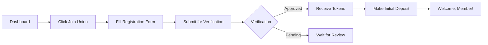

#### Step 3: Start Participating

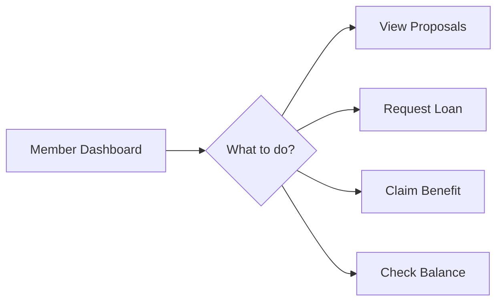

---

## Member Guide

### Dashboard Overview

```
┌────────────────────────────────────────────────────────────┐
│                    WORKER UNION DAO                         │
├────────────────────────────────────────────────────────────┤
│                                                             │
│  👋 Welcome, Alice!                                         │
│                                                             │
│  📊 Your Stats                                              │
│  ┌──────────────────────────────────────────────────────┐ │
│  │  Tokens Held:     100 UNT                             │ │
│  │  Voting Power:    100 UNT                             │ │
│  │  Vault Balance:   $1,000 USDC                         │ │
│  │  Your Share:      10%                                 │ │
│  └──────────────────────────────────────────────────────┘ │
│                                                             │
│  🗳️ Active Proposals          🏦 Emergency Loan           │
│  ┌─────────────────────┐     ┌─────────────────────┐     │
│  │ #42: Fund Kitchen   │     │ Max: $500           │     │
│  │ Ends in 3 days      │     │ Rate: 5% APY        │     │
│  │ [Vote] [View]       │     │ [Request Loan]      │     │
│  └─────────────────────┘     └─────────────────────┘     │
│                                                             │
│  🎁 Benefits                    💰 Treasury                 │
│  ┌─────────────────────┐     ┌─────────────────────┐     │
│  │ Medical: $2k/yr     │     │ Total: $50,000      │     │
│  │ [Claim Benefit]     │     │ [View Details]      │     │
│  └─────────────────────┘     └─────────────────────┘     │
│                                                             │
└────────────────────────────────────────────────────────────┘
```

### Joining the Union

#### Registration Process

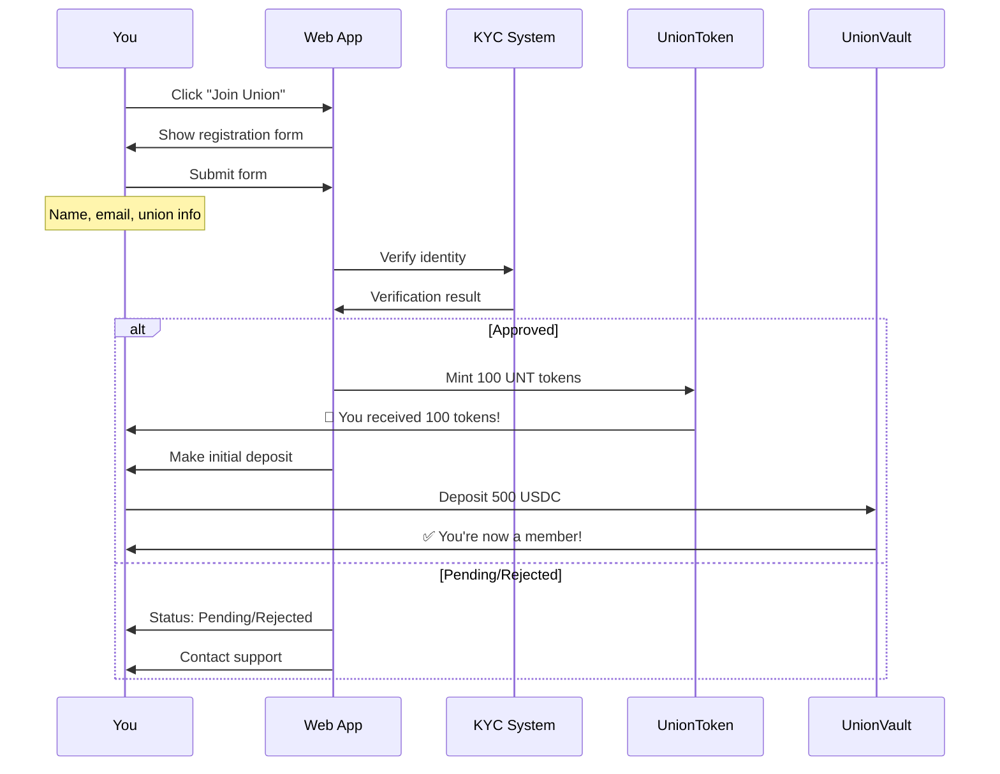

#### What You Get

| Benefit | Description |
|---------|-------------|
| 🪙 **Governance Tokens** | 100 UNT (voting power) |
| 💰 **Vault Share** | Proportional ownership of treasury |
| 🗳️ **Voting Rights** | 1 token = 1 vote on proposals |
| 🏦 **Loan Access** | Emergency loans up to 50% of contribution |
| 🎁 **Benefits** | Medical, unemployment, education support |

### Voting on Proposals

#### How to Vote

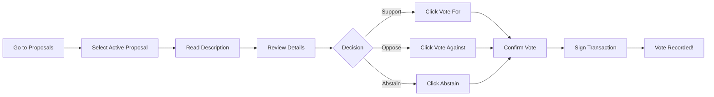

#### Understanding Proposals

```
┌────────────────────────────────────────────────────────────┐
│  Proposal #42: Fund Community Kitchen Project              │
├────────────────────────────────────────────────────────────┤
│                                                             │
│  📋 Type:           SPEND                                  │
│  👤 Proposer:       Alice (0x123...)                       │
│  📅 Created:        Jan 15, 2025                           │
│  ⏰ Voting Ends:    Jan 22, 2025 (3 days)                  │
│                                                             │
│  💰 Amount:         $5,000 USDC                            │
│  📬 Recipient:      Community Kitchen DAO                  │
│                                                             │
│  📝 Description:                                           │
│  This proposal requests funding to equip a community       │
│  kitchen that will provide meals to union members in       │
│  need. The kitchen will be staffed by volunteers and       │
│  serve approximately 50 meals per day.                     │
│                                                             │
│  📊 Current Votes:                                         │
│  ┌──────────────────────────────────────────────────────┐ │
│  │  ✅ For:      65% (6,500 UNT)                        │ │
│  │  ❌ Against:  30% (3,000 UNT)                        │ │
│  │  ⚪ Abstain:   5%  (500 UNT)                         │ │
│  │  ─────────────────────────────────────               │ │
│  │  Quorum: 40% ✓ | Turnout: 75%                        │ │
│  └──────────────────────────────────────────────────────┘ │
│                                                             │
│  🔗 View on Block Explorer                                 │
│                                                             │
│  [✅ Vote FOR]  [❌ Vote AGAINST]  [⚪ Abstain]            │
│                                                             │
└────────────────────────────────────────────────────────────┘
```

#### Voting Power Calculation

```
Your Voting Power = Total Tokens - Locked Tokens

Example:
  You hold:        100 UNT
  Locked (loan):   25 UNT
  ─────────────────────
  Voting Power:    75 UNT

Your vote counts as 75 votes
```

### Requesting a Loan

#### Loan Eligibility

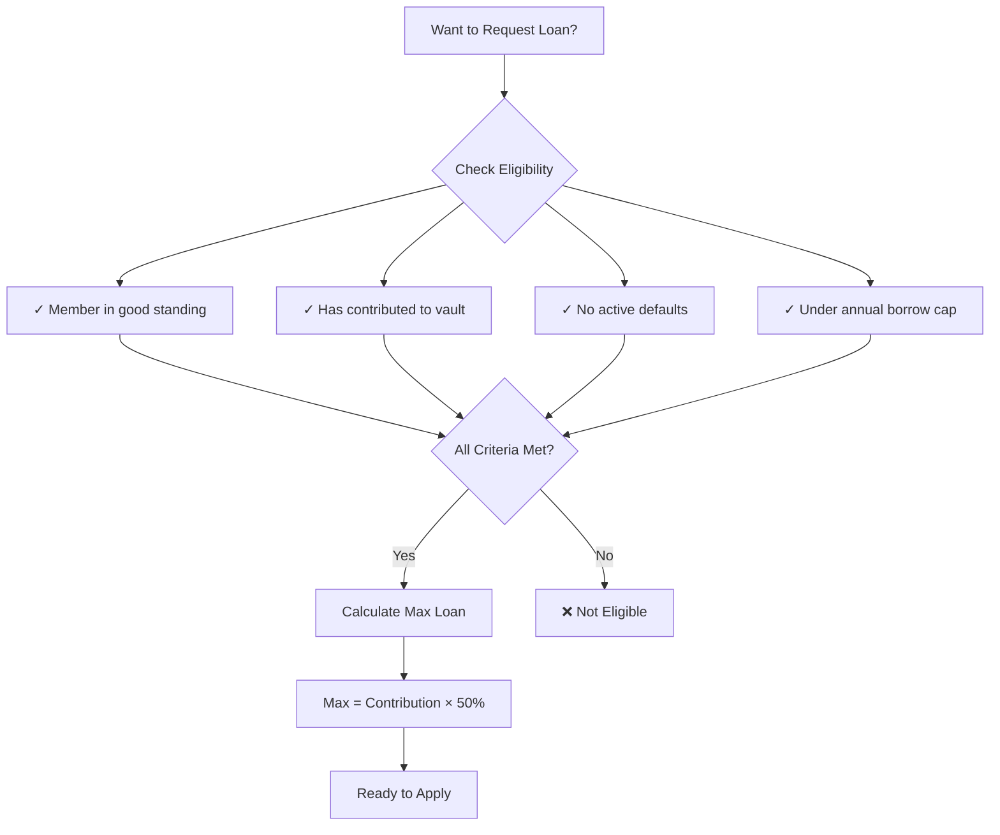

#### Loan Request Process

```
┌────────────────────────────────────────────────────────────┐
│  Emergency Loan Request                                    │
├────────────────────────────────────────────────────────────┤
│                                                             │
│  💵 Your Contribution:    $1,000 USDC                      │
│  🏦 Maximum Loan:         $500 USDC (50%)                  │
│  📊 Current Rate:         5% APY                           │
│                                                             │
│  ┌──────────────────────────────────────────────────────┐ │
│  │  Loan Amount:    [$500]         USDC                  │ │
│  │  Duration:       [30 days]     ▼                      │ │
│  │  Reason:         [Car repair for work]               │ │
│  └──────────────────────────────────────────────────────┘ │
│                                                             │
│  📋 Loan Summary:                                          │
│  ┌──────────────────────────────────────────────────────┐ │
│  │  Principal:       $500.00                             │ │
│  │  Interest:        $2.05 (5% APY, 30 days)            │ │
│  │  Total Repayment: $502.05                             │ │
│  │  Due Date:        Feb 22, 2025                        │ │
│  │  Collateral:      25 UNT tokens locked                │ │
│  └──────────────────────────────────────────────────────┘ │
│                                                             │
│  ⚠️ Your tokens will be locked as collateral              │
│                                                             │
│  [Cancel]                                      [Submit]     │
│                                                             │
└────────────────────────────────────────────────────────────┘
```

#### Loan Status Flow

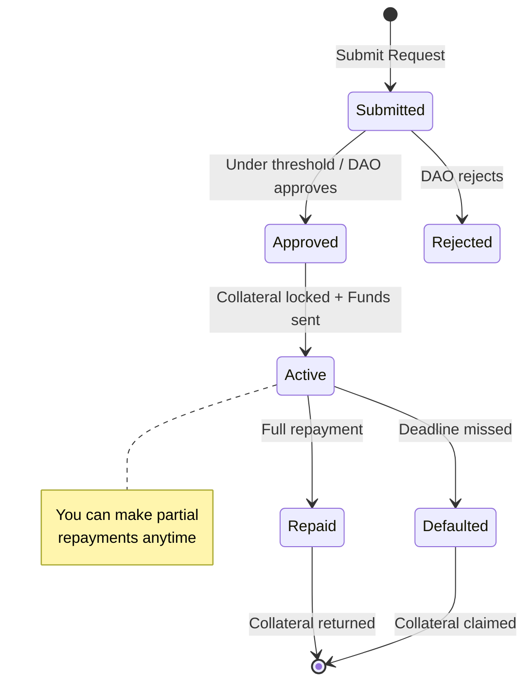

#### Repaying a Loan

```
┌────────────────────────────────────────────────────────────┐
│  Your Active Loans                                         │
├────────────────────────────────────────────────────────────┤
│                                                             │
│  📋 Loan #123                                              │
│  ┌──────────────────────────────────────────────────────┐ │
│  │  Principal:     $500.00                              │ │
│  │  Interest:      $2.05                                │ │
│  │  Repaid:        $300.00                              │ │
│  │  Remaining:     $202.05                              │ │
│  │  Due Date:      Feb 22, 2025 (5 days)                │ │
│  │  Collateral:    25 UNT locked                        │ │
│  └──────────────────────────────────────────────────────┘ │
│                                                             │
│  ┌──────────────────────────────────────────────────────┐ │
│  │  Repayment Amount:    [$202.05]        USDC           │ │
│  └──────────────────────────────────────────────────────┘ │
│                                                             │
│  [Repay Full]                     [Repay Partial]          │
│                                                             │
└────────────────────────────────────────────────────────────┘
```

### Claiming Benefits

#### Available Benefits

| Benefit Type | Annual Limit | Per-Claim Max | Cooling-Off |
|--------------|--------------|---------------|-------------|
| 🏥 Medical | $5,000 | $3,000 | 90 days |
| 💼 Unemployment | $3,000 | $1,000 | 180 days |
| 📚 Education | $2,000 | $2,000 | 365 days |
| 🏠 Housing | $4,000 | $2,000 | 180 days |

#### Claim Process

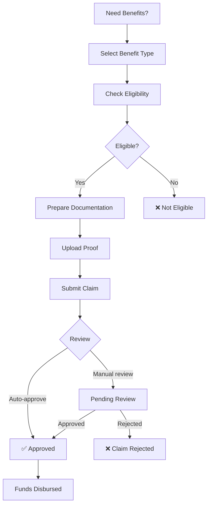

#### Claim Form

```
┌────────────────────────────────────────────────────────────┐
│  Claim Benefit                                             │
├────────────────────────────────────────────────────────────┤
│                                                             │
│  🎁 Benefit Type:     [Medical Emergency ▼]                │
│                                                             │
│  💰 Claim Amount:     [$2,000]               USDC          │
│                                                             │
│  📋 Your Limits:                                            │
│  ┌──────────────────────────────────────────────────────┐ │
│  │  Annual Remaining:  $3,000 / $5,000                  │ │
│  │  Per-Claim Max:     $3,000                           │ │
│  │  Last Claim:        60 days ago (90 day cooldown)    │ │
│  │  Status:            ✅ Eligible                       │ │
│  └──────────────────────────────────────────────────────┘ │
│                                                             │
│  📎 Proof of Claim:                                         │
│  ┌──────────────────────────────────────────────────────┐ │
│  │  📁 Upload Document (PDF, Image)                     │ │
│  │  or enter IPFS hash: [ipfs://Qm...]                 │ │
│  └──────────────────────────────────────────────────────┘ │
│                                                             │
│  📝 Additional Details:                                     │
│  ┌──────────────────────────────────────────────────────┐ │
│  │  [Emergency room visit for injury...]                │ │
│  └──────────────────────────────────────────────────────┘ │
│                                                             │
│  ⚠️ False claims may result in loss of membership          │
│                                                             │
│  [Cancel]                                      [Submit]     │
│                                                             │
└────────────────────────────────────────────────────────────┘
```

### Managing Your Account

#### Viewing Balances

```
┌────────────────────────────────────────────────────────────┐
│  Your Account                                              │
├────────────────────────────────────────────────────────────┤
│                                                             │
│  🪙 Union Tokens (UNT)                                      │
│  ┌──────────────────────────────────────────────────────┐ │
│  │  Total Balance:     100 UNT                          │ │
│  │  Available:         75 UNT   (voting power)           │ │
│  │  Locked:            25 UNT   (loan collateral)        │ │
│  └──────────────────────────────────────────────────────┘ │
│                                                             │
│  💰 Vault Contribution                                       │
│  ┌──────────────────────────────────────────────────────┐ │
│  │  Your Contribution: $1,000 USDC                      │ │
│  │  Total Vault Value:  $10,000 USDC                    │ │
│  │  Your Share:         10%                             │ │
│  │  Withdrawable:      $1,000 USDC                      │ │
│  └──────────────────────────────────────────────────────┘ │
│                                                             │
│  📊 Activity Summary                                        │
│  ┌──────────────────────────────────────────────────────┐ │
│  │  Proposals Voted:   5                                │ │
│  │  Loans Taken:       1 (active)                       │ │
│  │  Benefits Claimed:  1 (medical)                      │ │
│  │  Member Since:      Jan 15, 2025                     │ │
│  └──────────────────────────────────────────────────────┘ │
│                                                             │
└────────────────────────────────────────────────────────────┘
```

#### Exiting the Union

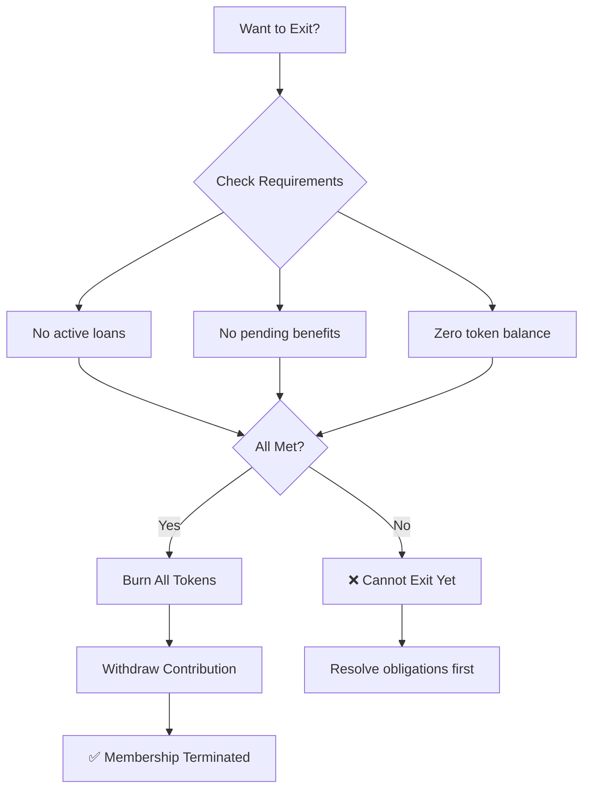

---

## Administrator Guide

### Administrative Functions

#### Initial Setup

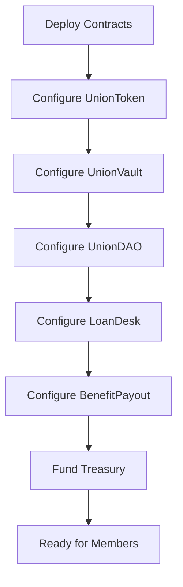

#### Configuration Checklist

| Contract | Parameter | Default | Range |
|----------|-----------|---------|-------|
| UnionToken | Max Supply | 1,000,000 UNT | Custom |
| UnionVault | Withdrawal Threshold | 1,000 USDC | 0-∞ |
| UnionVault | Withdrawal Timelock | 48 hours | 0-7 days |
| UnionDAO | Voting Period | 7 days | 1-30 days |
| UnionDAO | Quorum | 40% | 1-100% |
| UnionDAO | Execution Timelock | 48 hours | 0-7 days |
| LoanDesk | Interest Rate | 5% APY | 0-20% |
| LoanDesk | Max LTV | 50% | 0-100% |
| LoanDesk | Collateral Req. | 25% | 0-100% |
| BenefitPayout | Processing Time | 24 hours | 0-168 hours |

#### Member Management

```
┌────────────────────────────────────────────────────────────┐
│  Member Management                                         │
├────────────────────────────────────────────────────────────┤
│                                                             │
│  🔍 Search Member: [________________] [Search]             │
│                                                             │
│  📋 Members (127 total)                                    │
│  ┌──────────────────────────────────────────────────────┐ │
│  │ Name          │ Tokens │ Contrib. │ Status   │ Act. ││
│  ├──────────────────────────────────────────────────────┤ │
│  │ Alice Smith   │ 100    │ $1,000   │ Active   │ [...] ││
│  │ Bob Jones     │ 50     │ $500     │ Active   │ [...] ││
│  │ Carol White   │ 75     │ $750     │ Warning  │ [...] ││
│  │ Dave Black    │ 25     │ $250     │ Suspended│ [...] ││
│  └──────────────────────────────────────────────────────┘ │
│                                                             │
│  [Add Member]  [Export List]  [View Details]              │
│                                                             │
└────────────────────────────────────────────────────────────┘
```

#### Treasury Management

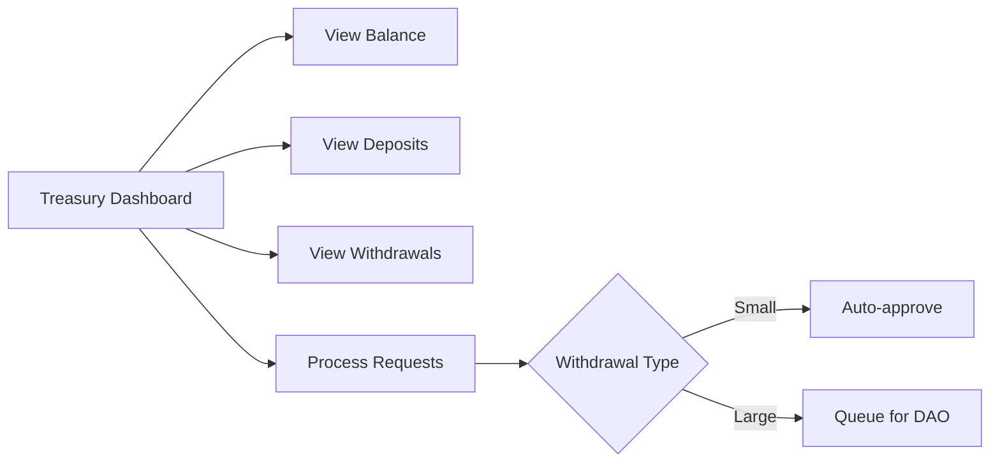

#### Emergency Controls

```
┌────────────────────────────────────────────────────────────┐
│  ⚠️ Emergency Controls                                     │
├────────────────────────────────────────────────────────────┤
│                                                             │
│  🔴 Pause All Operations                                   │
│  ┌──────────────────────────────────────────────────────┐ │
│  │  Stop all deposits, withdrawals, and operations      │ │
│  │  [Pause Contracts]                                    │ │
│  └──────────────────────────────────────────────────────┘ │
│                                                             │
│  🟢 Resume Operations                                      │
│  ┌──────────────────────────────────────────────────────┐ │
│  │  Restore normal operations                           │ │
│  │  [Unpause Contracts]                                  │ │
│  └──────────────────────────────────────────────────────┘ │
│                                                             │
│  🚨 Emergency Withdrawal                                    │
│  ┌──────────────────────────────────────────────────────┐ │
│  │  Withdraw funds in case of critical issue            │ │
│  │  Token: [USDC ▼]                                     │ │
│  │  Recipient: [0x...]                                  │ │
│  │  Amount: [____]                                       │ │
│  │  [Execute Emergency Withdrawal]                      │ │
│  └──────────────────────────────────────────────────────┘ │
│                                                             │
│  ⚠️ These actions require special permissions              │
│                                                             │
└────────────────────────────────────────────────────────────┘
```

---

## Developer Guide

### Local Development Setup

#### Prerequisites

```bash
# Install Foundry
curl -L https://foundry.paradigm.xyz | bash
foundryup

# Verify installation
forge --version
cast --version
anvil --version
```

#### Project Structure

```
worker-union-dao/
├── contracts/
│   ├── UnionToken.sol
│   ├── UnionVault.sol
│   ├── UnionDAO.sol
│   ├── LoanDesk.sol
│   └── BenefitPayout.sol
├── interfaces/
│   ├── IUnionToken.sol
│   ├── IUnionVault.sol
│   ├── IUnionDAO.sol
│   ├── ILoanDesk.sol
│   └── IBenefitPayout.sol
├── test/
│   ├── UnionToken.test.ts
│   ├── UnionVault.test.ts
│   └── integration/
│       └── full-flow.test.ts
├── scripts/
│   └── deploy.s.ts
└── foundry.toml
```

#### Running Tests

```bash
# Run all tests
forge test

# Run with gas report
forge test --gas-report

# Run specific test
forge test --match-test testVote

# Run with verbosity
forge test -vvvv

# Check coverage
forge coverage
```

#### Deployment

```bash
# Deploy to local anvil
anvil
forge script script/Deploy.s.s --broadcast --rpc-url http://localhost:8545

# Deploy to testnet
forge script script/Deploy.s.s --broadcast --rpc-url $SEPOLIA_RPC --account <account>

# Verify on Etherscan
forge verify-contract <address> <contract> --chain-id 11155111
```

### Frontend Integration

#### Web3 Integration Example

```typescript
import { useContract, useProvider, useSigner } from '@wagmi/lens'
import { Contract } from 'ethers'
import UNION_TOKEN_ABI from './abi/UnionToken.json'

function UnionTokenComponent() {
  const provider = useProvider()
  const { data: signer } = useSigner()

  const unionToken = new Contract(
    UNION_TOKEN_ADDRESS,
    UNION_TOKEN_ABI,
    provider ?? signer
  )

  const getBalance = async (address: string) => {
    return await unionToken.balanceOf(address)
  }

  const vote = async (proposalId: number, support: boolean) => {
    const tx = await unionToken.vote(proposalId, support)
    await tx.wait()
  }

  return { getBalance, vote }
}
```

#### Contract Hooks Example

```typescript
import { useContractRead, useContractWrite, usePrepareContractWrite } from 'wagmi'

function useUnionToken() {
  const { data: balance } = useContractRead({
    address: UNION_TOKEN_ADDRESS,
    abi: UNION_TOKEN_ABI,
    functionName: 'balanceOf',
    args: [address],
  })

  const { config } = usePrepareContractWrite({
    address: UNION_TOKEN_ADDRESS,
    abi: UNION_TOKEN_ABI,
    functionName: 'vote',
    args: [proposalId, support],
  })

  const { write: vote } = useContractWrite(config)

  return { balance, vote }
}
```

---

## Common Workflows

### Workflow 1: Onboarding New Members

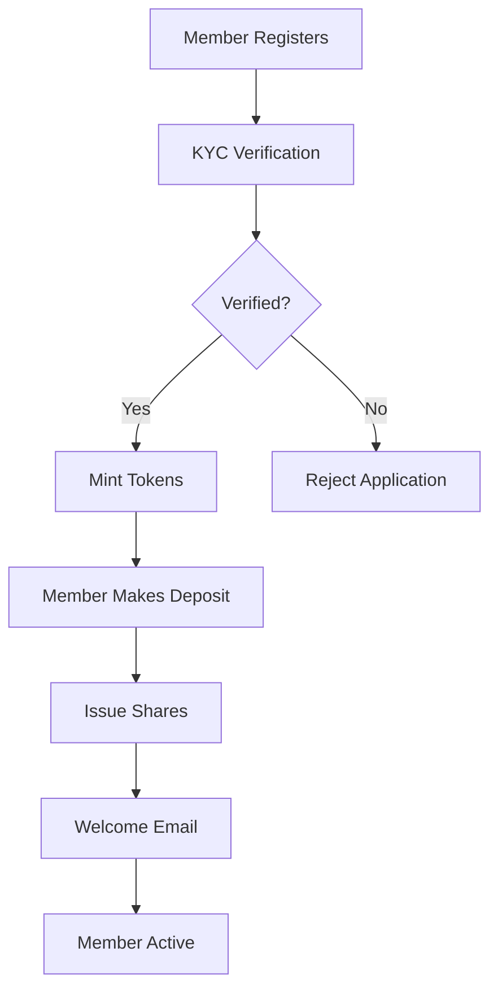

### Workflow 2: Monthly Treasury Report

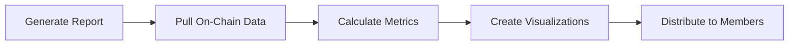

### Workflow 3: Loan Default Handling

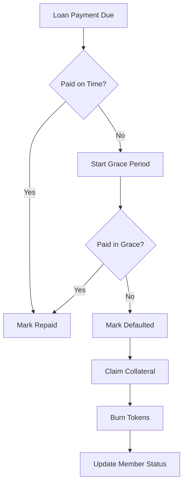

---

## Troubleshooting

### Common Issues

| Issue | Cause | Solution |
|-------|-------|----------|
| Transaction fails | Insufficient gas | Increase gas limit |
| Can't vote | Tokens locked | Wait for loan repayment |
| Loan rejected | Below contribution threshold | Increase contribution |
| Claim rejected | Cooling-off period | Wait until period expires |
| Can't withdraw | Paused contract | Contact admin |

### Getting Help

```
┌────────────────────────────────────────────────────────────┐
│  Need Help?                                                │
├────────────────────────────────────────────────────────────┤
│                                                             │
│  📚 Documentation       docs/                               │
│  💬 Community Discord  discord.gg/worker-union-dao          │
│  📧 Support Email      support@workeruniondao.org           │
│  🐛 Bug Report         github.com/worker-union-dao/issues   │
│                                                             │
│  Response Times:                                            │
│  - Documentation:  Immediate                                │
│  - Discord:      ~1 hour                                   │
│  - Email:        ~24 hours                                 │
│                                                             │
└────────────────────────────────────────────────────────────┘
```

---

*User Guide v1.0 - WorkerUnionDAO*
