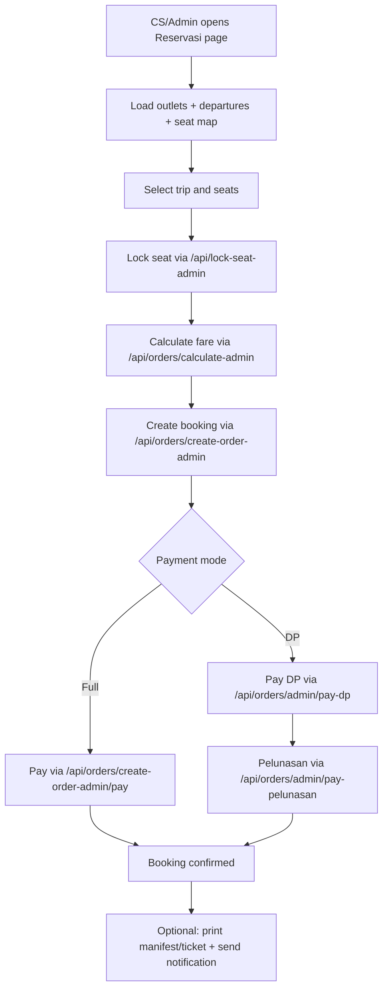
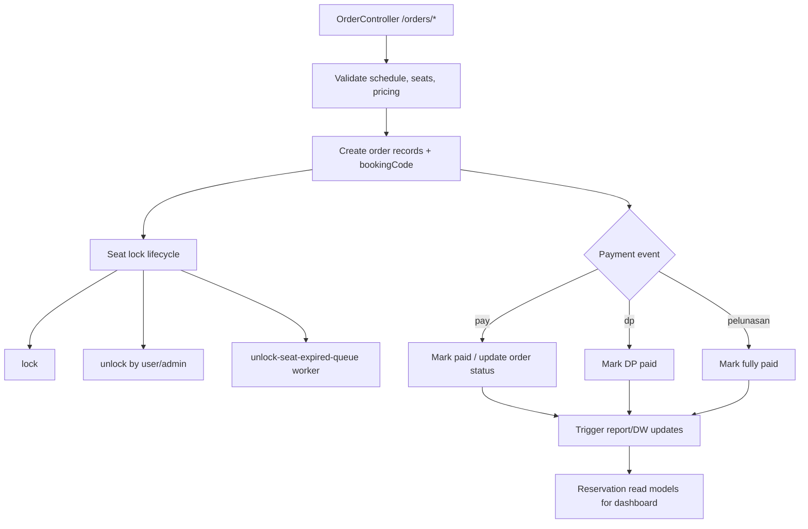

# Booking Flow (Dashboard + Backend)

## Dashboard Flowchart

## Backend Flowchart

## Use-Case Schema

| Actor | Dashboard Use Case | Backend Use Case |
|---|---|---|
| CS/Admin | Search schedule, choose seat, lock/unlock seat | Validate availability, create/cancel/seat mutation |
| CS/Admin | Create booking (`create-order-admin`) | Generate `bookingCode`, persist order set |
| CS/Admin | Pay full / DP / pelunasan | Execute payment handlers and status transitions |
| Supervisor/Admin level | Unlock conflict seat | Enforce lock authorization + queue-based expiry unlock |
| Ops | View reservation list/detail | Aggregate reservation/order views by booking |
