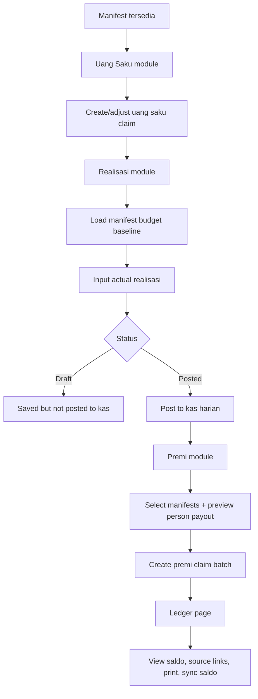
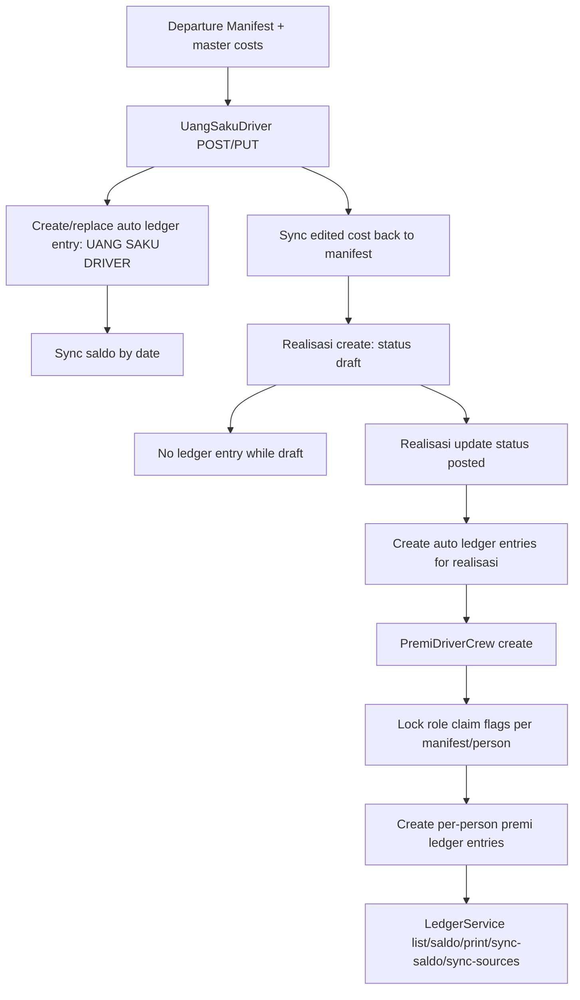

# Finance Flow (Manifest -> Uang Saku Claim -> Realisasi -> Premi Claim -> Kas Ledger)

## Dashboard Flowchart

## Backend Flowchart

## Use-Case Schema

| Actor | Dashboard Use Case | Backend Use Case |
|---|---|---|
| Finance/Ops | Input uang saku per manifest | Validate manifest cost, write `admin/uang-saku-driver`, create ledger auto-entry |
| Finance/Ops | Save realisasi as draft | Persist realisasi with `status=draft` (no kas posting yet) |
| Finance/Ops | Post realisasi | Convert to `posted`, generate ledger entries from realisasi accounting logic |
| Finance/Ops | Build premi claim batch | Validate claim flags, lock claim role, generate premi ledger entries |
| Kas/Admin | Monitor kas harian | Read `admin/ledger`, top-up/pull-saldo/manual/print/sync-saldo |
| Auditor | Trace source transaction | Follow `sourceType/sourceId` links to Uang Saku/Realisasi/Premi documents |
