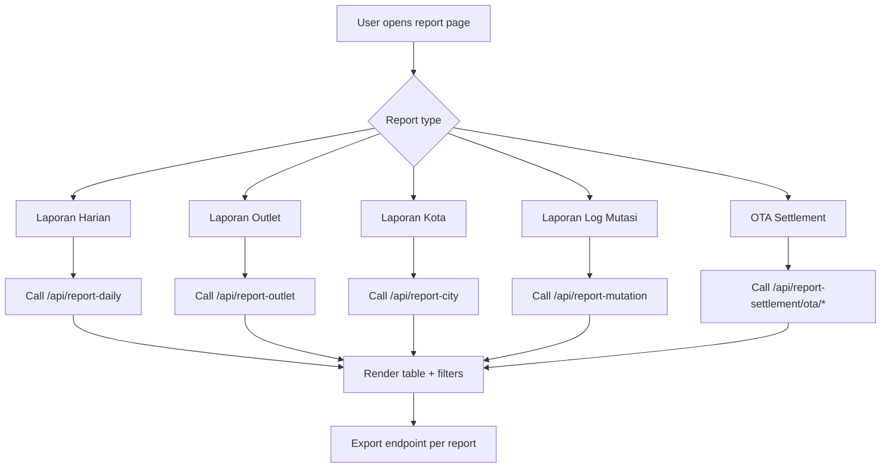

# Report Flow (DW Function)

## Dashboard Flowchart



## Backend Flowchart

```mermaid
flowchart TD
  A1[Operational transactions: order/payment/mutation] --> B1[DW updater hooks]
  B1 --> C1[DW collections]
  C1 --> C2[dwreportoutlets]
  C1 --> C3[checkpoint sync state]
  D1[GET /report-outlet/sync-data-warehousing] --> E1[Full/incremental sync process]
  E1 --> C2
  C2 --> F1[/report-outlet query]
  A1 --> G1[/report-daily, /report-mutation, /report-settlement]
  F1 --> H1[Paginated report response]
  G1 --> H1
  H1 --> I1[Export endpoints]
```

## Use-Case Schema

| Actor | Dashboard Use Case | Backend Use Case |
|---|---|---|
| Ops/Analyst | Open report modules and apply filter | Query report controllers (`report-*`) |
| Ops/Analyst | Trigger export (CSV/XLS/PDF-like) | Build export dataset from report service |
| Admin | Trigger DW sync (`report-outlet`) | Run full/incremental DW sync + checkpoint update |
| System | Auto reflect paid/cancel/mutation events | Update DW aggregates from transactional changes |
